# Unified Validation System

A comprehensive, modern .NET validation framework that provides fluent configuration, event-driven architecture, and advanced features for enterprise applications.

## Table of Contents

- [Overview](#overview)
- [Features](#features)
- [Quick Start](#quick-start)
- [Architecture](#architecture)
- [Usage Examples](#usage-examples)
- [Configuration](#configuration)
- [Advanced Features](#advanced-features)
- [API Reference](#api-reference)
- [Testing](#testing)
- [Contributing](#contributing)

## Overview

The Unified Validation System is a powerful, flexible validation framework designed to handle complex enterprise validation scenarios. It consolidates multiple validation patterns into a cohesive system with modern APIs, comprehensive functionality, and excellent performance.

### Key Benefits

- 🚀 **Fluent API**: Easy-to-use builder pattern for configuration
- 🔄 **Event-Driven**: Comprehensive event system for extensibility
- 📊 **Metrics & Observability**: Built-in monitoring and metrics collection
- 🛡️ **Reliability**: Circuit breakers, retries, and fault tolerance
- 🗃️ **Storage Agnostic**: Support for Entity Framework and MongoDB
- ⚡ **High Performance**: Thread-safe, efficient implementations
- 🔧 **Configurable**: Granular control over all features

## Features

### Core Validation Features
- Manual validation rules with named rule support
- Async and sync validation capabilities
- Detailed validation results with error tracking
- Threshold-based validation (GreaterThan, LessThan, etc.)
- Soft delete support with restoration capabilities

### Event System
- Unified event interfaces for consistent handling
- Auditable events with full audit trail
- Retryable events with attempt tracking
- Event-driven validation workflows
- Message-based communication patterns

### Infrastructure Features
- **Messaging**: MassTransit-based messaging with consumers
- **Metrics**: Comprehensive metrics collection and processing
- **Reliability**: Circuit breakers, retry policies, and fault tolerance
- **Auditing**: Full audit trail for all validation operations
- **Observability**: OpenTelemetry integration for monitoring

### Storage Support
- **Entity Framework**: Full EF Core integration with in-memory and SQL Server support
- **MongoDB**: Native MongoDB support for document-based storage
- **Unit of Work**: Pattern implementation for transactional operations

## Quick Start

### Getting Started Workflow

Follow this visual guide to get started with the Unified Validation System:


### 1. Installation

Add the packages to your project:

```bash
dotnet add package Validation.Domain
dotnet add package Validation.Infrastructure
```

### 2. Basic Setup

```csharp
using Microsoft.Extensions.DependencyInjection;
using Microsoft.Extensions.Hosting;
using Validation.Domain.Entities;
using Validation.Infrastructure.Setup;

var host = Host.CreateDefaultBuilder()
    .ConfigureServices(services =>
    {
        // Basic validation setup
        services.AddSetupValidation()
            .AddValidationFlow<Item>(flow => flow
                .EnableSaveValidation()
                .EnableDeleteValidation())
            .AddRule<Item>(item => item.Metric > 0)
            .Build();
    })
    .Build();
```

### 3. Use the Validator

```csharp
var validator = host.Services.GetRequiredService<IEnhancedManualValidatorService>();

var item = new Item(100);
var result = validator.ValidateWithDetails(item);

Console.WriteLine($"Valid: {result.IsValid}");
if (!result.IsValid)
{
    Console.WriteLine($"Failed Rules: {string.Join(", ", result.FailedRules)}");
}
```

## Architecture

The system is built on four core principles with a clean, modular design:


### 1. **Unified Messaging** (`ValidationFlow.Messages`)

Consistent message patterns for all validation flows with complete workflow support:


**Message Types:**
- **Save Operations**: `SaveRequested<T>`, `SaveValidated<T>`, `SaveCommitCompleted<T>`
- **Delete Operations**: `DeleteRequested<T>`, `DeleteValidated<T>`, `DeleteCommitCompleted<T>`
- **Soft Delete**: `SoftDeleteRequested<T>`, `SoftDeleteCompleted<T>`, `SoftDeleteRestored<T>`

### 2. **Event-Driven Design** (`Validation.Domain.Events`)

Interface-based events with unified handling and comprehensive audit trails:


### 3. **Builder Pattern** (`SetupValidationBuilder`)

Fluent API for comprehensive system configuration with modular setup:


**Configuration Example:**
```csharp
services.AddSetupValidation()
    .UseEntityFramework<MyDbContext>()
    .AddValidationFlow<Item>(flow => flow.EnableSaveValidation())
    .ConfigureMetrics(metrics => metrics.EnableDetailedMetrics())
    .ConfigureReliability(reliability => reliability.WithMaxRetries(3))
    .Build();
```

### 4. **Modular Infrastructure** (`Validation.Infrastructure`)

Comprehensive infrastructure with fault tolerance and observability:


**Key Features:**
- **Messaging**: MassTransit-based message bus with consumer patterns
- **Reliability**: Circuit breakers, retry policies, and fault tolerance
- **Metrics**: Comprehensive metrics collection and OpenTelemetry integration  
- **Auditing**: Full audit trail for compliance and debugging

## Usage Examples

### Validation Workflows

The system supports multiple validation workflows with comprehensive error handling and audit trails:


### Basic Validation

```csharp
// Configure validation
services.AddValidation(setup => setup
    .AddValidationFlow<Item>(flow => flow.EnableSaveValidation())
    .AddRule<Item>(item => item.Metric > 0));

// Use validator
var validator = serviceProvider.GetService<IEnhancedManualValidatorService>();
var result = validator.ValidateWithDetails(item);
```

### Advanced Configuration

```csharp
services.AddSetupValidation()
    .UseEntityFramework<MyDbContext>()
    
    // Configure validation flows
    .AddValidationFlow<Item>(flow => flow
        .EnableSaveValidation()
        .EnableDeleteValidation()
        .EnableSoftDelete()
        .WithThreshold(x => x.Metric, ThresholdType.GreaterThan, 100)
        .WithValidationTimeout(TimeSpan.FromMinutes(5))
        .EnableAuditing())
    
    // Add validation rules
    .AddRule<Item>("PositiveValue", item => item.Metric > 0)
    .AddRule<Item>("MaxValue", item => item.Metric <= 1000)
    
    // Configure infrastructure
    .ConfigureMetrics(metrics => metrics
        .WithProcessingInterval(TimeSpan.FromMinutes(1))
        .EnableDetailedMetrics())
    .ConfigureReliability(reliability => reliability
        .WithMaxRetries(3)
        .WithRetryDelay(TimeSpan.FromSeconds(2)))
    
    .Build();
```

### MongoDB Integration

```csharp
services.AddSetupValidation()
    .UseMongoDB("mongodb://localhost:27017", "validation")
    .AddValidationFlow<Item>(flow => flow
        .EnableSaveValidation()
        .EnableSoftDelete())
    .Build();
```

### Event Handling


```csharp
void ProcessValidationEvent(IValidationEvent validationEvent)
{
    Console.WriteLine($"Processing {validationEvent.EntityType} event");
    
    if (validationEvent is IAuditableEvent auditableEvent)
    {
        Console.WriteLine($"Audit ID: {auditableEvent.AuditId}");
    }
    
    if (validationEvent is IRetryableEvent retryableEvent)
    {
        Console.WriteLine($"Attempt: {retryableEvent.AttemptNumber}");
    }
}
```

## Configuration

### ValidationFlowConfig Options

```csharp
public class ValidationFlowConfig
{
    public bool SaveValidation { get; set; }        // Enable save validation
    public bool SaveCommit { get; set; }            // Enable save commit flow
    public bool DeleteValidation { get; set; }      // Enable delete validation
    public bool DeleteCommit { get; set; }          // Enable delete commit flow
    public bool SoftDeleteSupport { get; set; }     // Enable soft delete
    public TimeSpan? ValidationTimeout { get; set; } // Validation timeout
    public int? MaxRetryAttempts { get; set; }      // Maximum retry attempts
    public bool EnableAuditing { get; set; }        // Enable audit trail
    public bool EnableMetrics { get; set; }         // Enable metrics collection
}
```

### Metrics Configuration

```csharp
.ConfigureMetrics(metrics => metrics
    .WithProcessingInterval(TimeSpan.FromMinutes(1))
    .EnableDetailedMetrics(true)
    .WithCustomCollector<MyMetricsCollector>())
```

### Reliability Configuration

```csharp
.ConfigureReliability(reliability => reliability
    .WithMaxRetries(3)
    .WithRetryDelay(TimeSpan.FromSeconds(2))
    .WithCircuitBreaker(threshold: 5, timeout: TimeSpan.FromMinutes(1))
    .WithCustomPolicy<MyReliabilityPolicy>())
```

## Advanced Features

### Named Validation Rules

```csharp
validator.AddRule<Item>("PositiveValue", item => item.Metric > 0);
validator.AddRule<Item>("MaxValue", item => item.Metric <= 1000);

var result = validator.ValidateWithDetails(item);
Console.WriteLine($"Failed Rules: {string.Join(", ", result.FailedRules)}");
```

### Async Validation

```csharp
var result = await validator.ValidateAsync(item);
```

### Soft Delete Operations

```csharp
// Enable soft delete in configuration
.AddValidationFlow<Item>(flow => flow.EnableSoftDelete())

// Events generated:
// - SoftDeleteRequested
// - SoftDeleteCompleted
// - SoftDeleteRestored
```

### Threshold Validation

```csharp
.WithThreshold(x => x.Metric, ThresholdType.GreaterThan, 100)
.WithThreshold(x => x.Value, ThresholdType.LessThan, 1000)
```

### Custom Validation Rules

```csharp
public class CustomRule : IValidationRule<Item>
{
    public bool IsValid(Item item) => item.Metric % 2 == 0;
    public string Name => "EvenNumber";
}

services.AddValidationRule<Item, CustomRule>();
```

## API Reference

### Core Interfaces

#### IEnhancedManualValidatorService

The primary interface for validation operations with comprehensive features:


**Usage Examples:**

```csharp
// Basic validation
var result = validator.ValidateWithDetails(item);
if (!result.IsValid)
{
    foreach (var error in result.Errors)
    {
        Console.WriteLine($"Rule '{error.RuleName}' failed: {error.ErrorMessage}");
    }
}

// Async validation
var asyncResult = await validator.ValidateAsync(item);

// Rule management
validator.AddRule<Item>("PositiveValue", item => item.Metric > 0);
validator.AddRule<Item>("ReasonableRange", item => item.Metric <= 1000);
var ruleNames = validator.GetRuleNames<Item>(); // ["PositiveValue", "ReasonableRange"]
validator.RemoveRule<Item>("PositiveValue");
```

#### IValidationEvent

Central interface for all validation events:

```csharp
public interface IValidationEvent
{
    Guid EntityId { get; }
    string EntityType { get; }
    DateTime Timestamp { get; }
}

// Extended interfaces
public interface IAuditableEvent : IValidationEvent
{
    Guid? AuditId { get; }
    string? AuditDetails { get; }
}

public interface IRetryableEvent : IValidationEvent
{
    int AttemptNumber { get; }
}
```

#### SetupValidationBuilder

Fluent configuration builder with comprehensive options:


**Complete API:**

```csharp
public class SetupValidationBuilder
{
    // Storage configuration
    SetupValidationBuilder UseEntityFramework<TContext>() where TContext : DbContext;
    SetupValidationBuilder UseMongoDB(string connectionString, string databaseName);
    SetupValidationBuilder UseInMemory();
    
    // Validation flow configuration
    SetupValidationBuilder AddValidationFlow<T>(Action<ValidationFlowBuilder<T>> configure);
    
    // Rule configuration
    SetupValidationBuilder AddRule<T>(Func<T, bool> rule);
    SetupValidationBuilder AddRule<T>(string name, Func<T, bool> rule);
    SetupValidationBuilder WithThreshold<T>(Expression<Func<T, IComparable>> property, 
        ThresholdType type, IComparable threshold);
    
    // Infrastructure configuration
    SetupValidationBuilder ConfigureMetrics(Action<MetricsBuilder> configure);
    SetupValidationBuilder ConfigureReliability(Action<ReliabilityBuilder> configure);
    SetupValidationBuilder ConfigureAuditing(Action<AuditingBuilder> configure);
    
    // Build and register
    void Build();
}
```

### Event Types

Complete event hierarchy for all validation scenarios:


### Configuration Reference

#### ValidationFlowConfig

```csharp
public class ValidationFlowConfig
{
    public bool SaveValidation { get; set; } = true;        // Enable save validation
    public bool SaveCommit { get; set; } = true;            // Enable save commit flow
    public bool DeleteValidation { get; set; } = true;      // Enable delete validation
    public bool DeleteCommit { get; set; } = true;          // Enable delete commit flow
    public bool SoftDeleteSupport { get; set; } = false;    // Enable soft delete
    public TimeSpan? ValidationTimeout { get; set; }        // Validation timeout
    public TimeSpan? OperationTimeout { get; set; }         // Operation timeout
    public int? MaxRetryAttempts { get; set; } = 3;        // Maximum retry attempts
    public TimeSpan? RetryDelay { get; set; }              // Delay between retries
    public bool EnableAuditing { get; set; } = true;        // Enable audit trail
    public bool EnableMetrics { get; set; } = true;         // Enable metrics collection
    public bool EnableReliability { get; set; } = true;     // Enable reliability patterns
    public string? EntityType { get; set; }                 // Entity type identifier
    public List<ThresholdConfig> Thresholds { get; set; } = new(); // Threshold configurations
}
```

#### MetricsConfiguration

```csharp
.ConfigureMetrics(metrics => metrics
    .WithProcessingInterval(TimeSpan.FromMinutes(1))     // How often to process metrics
    .EnableDetailedMetrics(true)                         // Include detailed metrics
    .WithCustomCollector<MyMetricsCollector>()           // Add custom collector
    .WithRetentionPeriod(TimeSpan.FromDays(30))         // How long to keep metrics
    .EnablePerformanceCounters(true))                    // Enable performance counters
```

#### ReliabilityConfiguration

```csharp
.ConfigureReliability(reliability => reliability
    .WithMaxRetries(3)                                   // Maximum retry attempts
    .WithRetryDelay(TimeSpan.FromSeconds(2))            // Delay between retries
    .WithExponentialBackoff(true)                        // Use exponential backoff
    .WithCircuitBreaker(threshold: 5, timeout: TimeSpan.FromMinutes(1)) // Circuit breaker
    .WithTimeout(TimeSpan.FromMinutes(5))               // Operation timeout
    .WithCustomPolicy<MyReliabilityPolicy>())           // Custom reliability policy
```

## Testing

The system includes comprehensive test coverage across all components:


```bash
# Run all tests
dotnet test

# Run specific test categories
dotnet test --filter Category=Unit
dotnet test --filter Category=Integration
dotnet test --filter Category=Performance
dotnet test --filter Category=Reliability
```

### Test Structure
- **Unit Tests**: Core validation logic, rules, and utilities
- **Integration Tests**: Full system tests with database and messaging
- **Performance Tests**: Load and performance validation
- **Reliability Tests**: Circuit breaker and retry functionality

### Running Sample Application

```bash
cd Validation.SampleApp
dotnet run
```

The sample application demonstrates:
- Basic validation setup
- Enhanced validator usage
- Event handling
- Unified messaging
- Configuration options

## Troubleshooting

### Common Issues and Solutions

#### 1. Validation Performance Issues

**Problem**: Validation is slow with large datasets


**Solutions:**
```csharp
// 1. Use efficient rule configurations
.ConfigureMetrics(metrics => metrics
    .WithProcessingInterval(TimeSpan.FromMinutes(5))  // Reduce frequency
    .EnableDetailedMetrics(false))                    // Disable detailed metrics

// 2. Optimize database queries
.UseEntityFramework<MyDbContext>(options => 
    options.EnableServiceProviderCaching()
           .EnableSensitiveDataLogging(false))

// 3. Use batch operations
var results = await validator.ValidateBatchAsync(items);
```

#### 2. Message Processing Failures

**Problem**: Messages are not being processed correctly

**Diagnostic Steps:**
```csharp
// Check message bus health
var busControl = serviceProvider.GetService<IBusControl>();
var healthResult = await busControl.GetProbeResult();

// Enable detailed logging
services.AddLogging(builder => builder
    .AddConsole()
    .SetMinimumLevel(LogLevel.Debug));

// Monitor consumer activity
.ConfigureMetrics(metrics => metrics
    .EnableDetailedMetrics(true)
    .WithConsumerMetrics())
```

#### 3. Database Connection Issues

**Problem**: Database connectivity problems

**Solutions:**
```csharp
// Configure connection resilience
services.AddDbContext<MyDbContext>(options =>
    options.UseSqlServer(connectionString, sqlOptions =>
        sqlOptions.EnableRetryOnFailure(
            maxRetryCount: 3,
            maxRetryDelay: TimeSpan.FromSeconds(5),
            errorNumbersToAdd: null)));

// Add health checks
services.AddHealthChecks()
    .AddDbContextCheck<MyDbContext>()
    .AddCheck<ValidationSystemHealthCheck>("validation-system");
```

#### 4. Memory Leaks

**Problem**: Memory usage grows over time

**Diagnostic and Solutions:**
```csharp
// Configure proper disposal
services.AddScoped<IEnhancedManualValidatorService, EnhancedManualValidatorService>();

// Use memory-efficient configurations
.ConfigureMetrics(metrics => metrics
    .WithRetentionPeriod(TimeSpan.FromHours(1))  // Shorter retention
    .EnableMemoryOptimizations(true))

// Monitor memory usage
var memoryBefore = GC.GetTotalMemory(false);
// ... validation operations
var memoryAfter = GC.GetTotalMemory(true);
Console.WriteLine($"Memory used: {memoryAfter - memoryBefore} bytes");
```

### Performance Optimization

#### Optimization Checklist


#### 1. Rule Performance

```csharp
// Efficient rule implementation
validator.AddRule<Item>("OptimizedRule", item => 
{
    // Cache expensive calculations
    var cachedValue = _cache.GetOrSet($"item-{item.Id}", 
        () => ExpensiveCalculation(item));
    return cachedValue > 0;
});

// Use compiled expressions for better performance
private static readonly Func<Item, bool> CompiledRule = 
    ((Expression<Func<Item, bool>>)(item => item.Metric > 0)).Compile();
```

#### 2. Database Performance

```csharp
// Optimize Entity Framework configuration
services.AddDbContext<MyDbContext>(options =>
{
    options.UseSqlServer(connectionString)
           .EnableServiceProviderCaching()
           .EnableSensitiveDataLogging(false)
           .ConfigureWarnings(warnings => 
               warnings.Ignore(CoreEventId.SensitiveDataLoggingEnabledWarning));
});

// Use read-only queries when possible
var items = await context.Items
    .AsNoTracking()
    .Where(i => i.IsActive)
    .ToListAsync();
```

#### 3. Messaging Performance

```csharp
// Configure MassTransit for performance
services.AddMassTransit(x =>
{
    x.UsingInMemory((context, cfg) =>
    {
        cfg.ConcurrentMessageLimit = 100;
        cfg.PrefetchCount = 50;
        cfg.ConfigureEndpoints(context);
    });
});

// Use message compression for large payloads
services.Configure<MassTransitHostOptions>(options =>
{
    options.WaitUntilStarted = true;
    options.StartTimeout = TimeSpan.FromSeconds(30);
});
```

### Monitoring and Diagnostics

#### Health Check Implementation

```csharp
public class ValidationSystemHealthCheck : IHealthCheck
{
    private readonly IEnhancedManualValidatorService _validator;
    
    public async Task<HealthCheckResult> CheckHealthAsync(
        HealthCheckContext context, 
        CancellationToken cancellationToken = default)
    {
        try
        {
            // Test basic validation functionality
            var testItem = new Item(100);
            var result = await _validator.ValidateAsync(testItem);
            
            return result.IsValid 
                ? HealthCheckResult.Healthy("Validation system is working")
                : HealthCheckResult.Degraded("Validation system has issues");
        }
        catch (Exception ex)
        {
            return HealthCheckResult.Unhealthy("Validation system is down", ex);
        }
    }
}
```

#### Performance Monitoring

```csharp
// Add performance counters
services.AddSingleton<IMetricsCollector, PerformanceMetricsCollector>();

// Configure OpenTelemetry
services.AddOpenTelemetry()
    .WithTracing(builder => builder
        .AddSource("ValidationSystem")
        .AddJaegerExporter())
    .WithMetrics(builder => builder
        .AddMeter("ValidationSystem.Metrics")
        .AddPrometheusExporter());
```

## Project Structure

The repository is organized into logical modules with clear separation of concerns:

```mermaid
graph TD
    subgraph "Solution Structure"
        A[Validation.sln]
        A --> B[Validation.Domain]
        A --> C[Validation.Infrastructure] 
        A --> D[ValidationFlow.Messages]
        A --> E[Validation.Tests]
        A --> F[Validation.SampleApp]
        A --> G[Validation.RepositoryPattern.Sample]
    end
    
    subgraph "Domain Layer"
        B --> B1[📁 Entities]
        B --> B2[📁 Events]
        B --> B3[📁 Validation]
        B --> B4[📁 Repositories]
        B --> B5[📁 Providers]
        
        B1 --> B1A[Item.cs]
        B1 --> B1B[EntityWithEvents.cs]
        B2 --> B2A[UnifiedValidationEvents.cs]
        B2 --> B2B[SaveValidated.cs]
        B3 --> B3A[IValidationRule.cs]
        B3 --> B3B[ValidationPlan.cs]
    end
    
    subgraph "Infrastructure Layer"
        C --> C1[📁 Messaging]
        C --> C2[📁 Setup]
        C --> C3[📁 Reliability]
        C --> C4[📁 Metrics]
        C --> C5[📁 Repositories]
        
        C1 --> C1A[MassTransit Consumers]
        C2 --> C2A[SetupValidationBuilder.cs]
        C3 --> C3A[Circuit Breakers]
        C4 --> C4A[MetricsOrchestrator.cs]
    end
    
    subgraph "Message Contracts"
        D --> D1[SaveMessages.cs]
        D --> D2[Delete Messages]
        D --> D3[Event Messages]
    end
    
    subgraph "Testing & Samples"
        E --> E1[📁 Unit Tests]
        E --> E2[📁 Integration Tests]
        E --> E3[📁 Performance Tests]
        
        F --> F1[Program.cs - Demo App]
        
        G --> G1[📁 Repository Pattern Examples]
        G --> G2[📁 Business Services]
    end
    
    style B fill:#e1f5fe
    style C fill:#f3e5f5
    style D fill:#e8f5e8
    style E fill:#fff3e0
    style F fill:#fce4ec
    style G fill:#f1f8e9
```



### Directory Structure

```
├── Validation.Domain/              # 🏗️ Core domain logic and entities
│   ├── Entities/                   # Domain entities with business logic
│   │   ├── Item.cs                 # Sample validatable entity
│   │   ├── NannyRecord.cs          # Complex validation example
│   │   └── EntityWithEvents.cs     # Base class for event-enabled entities
│   ├── Events/                     # 🎯 Unified event system
│   │   ├── UnifiedValidationEvents.cs  # Central event interfaces
│   │   ├── SaveValidated.cs        # Save operation events
│   │   └── DeleteRequested.cs      # Delete operation events
│   ├── Validation/                 # ✅ Core validation engine
│   │   ├── IValidationRule.cs      # Validation rule contracts
│   │   ├── ValidationPlan.cs       # Comprehensive validation plans
│   │   ├── ThresholdType.cs        # Threshold comparison types
│   │   └── ValidationStrategy.cs   # Validation approaches
│   ├── Repositories/               # 📊 Data access abstractions
│   └── Providers/                  # 🔧 Service provider interfaces
│
├── Validation.Infrastructure/      # 🛠️ Infrastructure implementations
│   ├── Setup/                      # ⚙️ System configuration
│   │   ├── SetupValidationBuilder.cs   # Fluent configuration API
│   │   └── ValidationSetupService.cs   # Initialization service
│   ├── Messaging/                  # 📨 MassTransit-based messaging
│   │   ├── SaveValidationConsumer.cs   # Save message consumers
│   │   ├── DeleteValidationConsumer.cs # Delete message consumers
│   │   └── ValidationEventHub.cs       # Event coordination
│   ├── Reliability/                # 🛡️ Fault tolerance patterns
│   │   ├── DeletePipelineReliabilityPolicy.cs  # Reliability policies
│   │   └── MassTransitReliability.cs           # MassTransit reliability
│   ├── Metrics/                    # 📈 Metrics and observability
│   │   └── MetricsOrchestrator.cs       # Metrics coordination
│   ├── Pipeline/                   # 🔄 Workflow orchestration
│   │   ├── ValidationFlowOrchestrator.cs    # Main workflow coordinator
│   │   └── MetricsPipelineOrchestrator.cs  # Metrics pipeline
│   ├── Repositories/               # 💾 Data access implementations
│   ├── Auditing/                   # 📋 Audit trail functionality
│   └── Observability/              # 👁️ OpenTelemetry integration
│
├── ValidationFlow.Messages/        # 📬 Message contracts
│   ├── SaveMessages.cs             # Save operation messages
│   └── README.md                   # Message documentation
│
├── Validation.Tests/               # 🧪 Comprehensive test suite
│   ├── Unit Tests/                 # Individual component tests
│   ├── Integration Tests/          # Full system tests
│   ├── Performance Tests/          # Load and performance tests
│   └── Reliability Tests/          # Fault tolerance tests
│
├── Validation.SampleApp/           # 🎮 Interactive demo application
│   ├── Program.cs                  # Main demonstration program
│   └── README.md                   # Usage examples
│
├── Validation.RepositoryPattern.Sample/  # 📚 Integration examples
│   ├── Models/                     # Domain entities
│   ├── Repositories/               # Repository implementations
│   ├── Services/                   # Business services
│   └── README.md                   # Integration guide
│
├── README.md                       # 📖 Main documentation
├── UNIFIED_VALIDATION_SYSTEM.md    # 🎯 System overview
├── Agents.md                       # 🤖 Development guidelines
└── Validation.Examples.cs          # 💡 Code examples
```

See individual folder README files for detailed information about each component.

## Contributing

1. Fork the repository
2. Create a feature branch
3. Make your changes
4. Add/update tests
5. Ensure all tests pass
6. Submit a pull request

### Development Requirements

- .NET 8.0 or later
- Entity Framework Core 8.0+
- MongoDB (for MongoDB features)
- Visual Studio 2022 or VS Code

## License

This project is licensed under the MIT License - see the LICENSE file for details.

## Support

For questions, issues, or contributions:
- Create an issue in the GitHub repository
- Check the existing documentation
- Review the sample application for usage examples