# Validation.Domain

The core domain layer of the Unified Validation System containing entities, validation rules, events, and repositories with comprehensive event-driven architecture.

## Overview

This assembly contains the essential domain logic and provides a clean separation between business rules and infrastructure concerns. It defines the core abstractions and implementations that drive the validation system using Domain-Driven Design principles.

## Domain Architecture

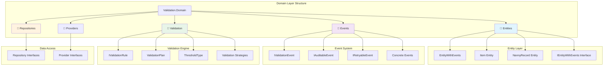

## Domain Event System

### Event Hierarchy and Relationships

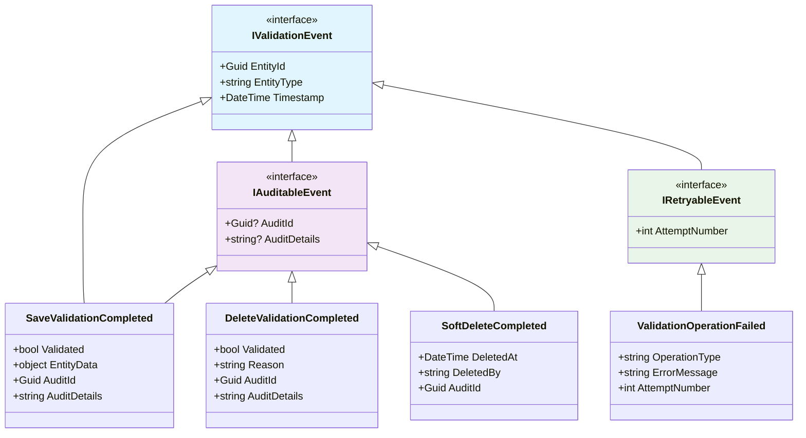

### Event Workflow Patterns

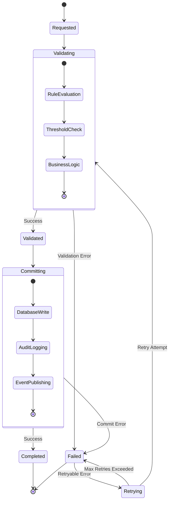

## Folder Structure

### 📁 `Entities/`
Core domain entities and their contracts.

- **`IEntityWithEvents.cs`** - Interface for entities that can raise domain events
- **`EntityWithEvents.cs`** - Base class implementation for event-enabled entities
- **`Item.cs`** - Sample entity representing a validatable item with metric properties
- **`NannyRecord.cs`** - Sample entity demonstrating different validation scenarios

### 📁 `Events/`
Domain events and unified event system interfaces.

- **`DeleteRequested.cs`** - Event raised when delete operation is requested
- **`DeleteValidation.cs`** - Events related to delete validation workflows
- **`SaveRequested.cs`** - Event raised when save operation is requested  
- **`SaveRequested.Generic.cs`** - Generic version of save requested event
- **`SaveValidated.cs`** - Event raised when save validation completes
- **`SaveValidated.Generic.cs`** - Generic version of save validated event
- **`SaveCommitFault.cs`** - Event raised when save commit operation fails
- **`UnifiedValidationEvents.cs`** - ⭐ **Central event system with unified interfaces**

### 📁 `Repositories/`
Repository pattern interfaces for data access abstraction.

*Files in this folder define contracts for data access without implementation details.*

## Validation Engine Architecture

### Validation Rule System

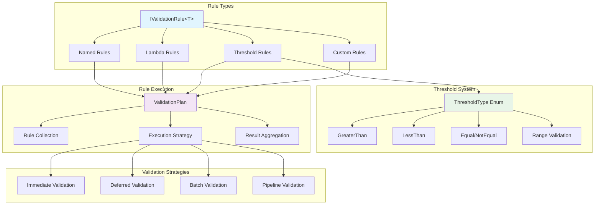

### Rule Execution Flow

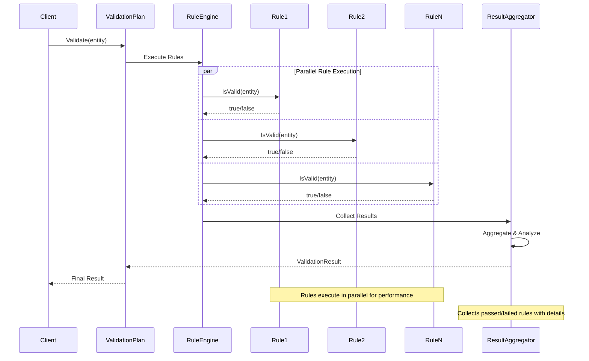

### Validation Rule Implementations

#### 1. Basic Rule Interface

```csharp
public interface IValidationRule<in T>
{
    bool IsValid(T item);
    string Name { get; }
    string? Description { get; }
    ValidationSeverity Severity { get; }
}

public enum ValidationSeverity
{
    Info,       // Informational, doesn't affect validity
    Warning,    // Warning, but entity is still valid
    Error,      // Error, entity is invalid
    Critical    // Critical error, stop all processing
}
```

#### 2. Advanced Rule Types

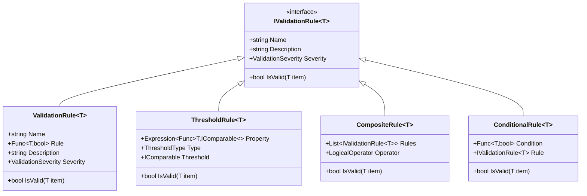

#### 3. Threshold Validation System

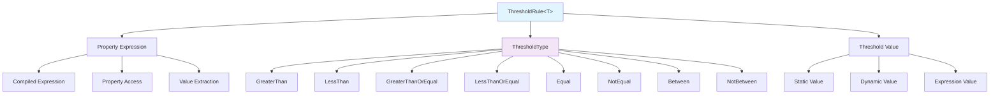

### Validation Plan System

```mermaid
graph TD
    subgraph "ValidationPlan Components"
        A[ValidationPlan&lt;T&gt;]
        A --> B[Rule Collection]
        A --> C[Execution Strategy]
        A --> D[Error Handling]
        A --> E[Result Processing]
    end
    
    subgraph "Rule Collection Management"
        B --> B1[Add Rules]
        B --> B2[Remove Rules]
        B --> B3[Find Rules]
        B --> B4[Clear Rules]
    end
    
    subgraph "Execution Strategies"
        C --> C1[FailFast Strategy]
        C --> C2[ContinueOnError Strategy]
        C --> C3[Parallel Execution]
        C --> C4[Sequential Execution]
    end
    
    subgraph "Error Handling"
        D --> D1[Rule Exceptions]
        D --> D2[Validation Failures]
        D --> D3[System Errors]
        D --> D4[Recovery Strategies]
    end
    
    subgraph "Result Processing"
        E --> E1[Success Results]
        E --> E2[Failure Results]
        E --> E3[Detailed Reports]
        E --> E4[Performance Metrics]
    end
    
    style A fill:#e1f5fe
    style C fill:#f3e5f5
    style E fill:#e8f5e8
```

### Validation Strategy Patterns

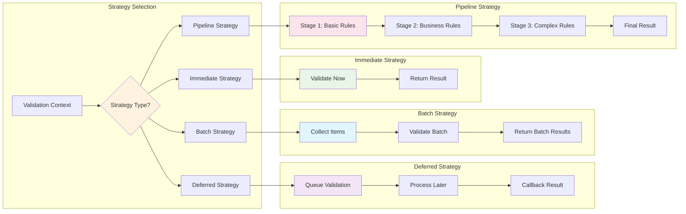

## Key Interfaces

### IValidationEvent
Central interface for all validation events, enabling unified event handling:

```csharp
public interface IValidationEvent
{
    Guid EntityId { get; }
    string EntityType { get; }
    DateTime Timestamp { get; }
}
```

### IAuditableEvent
Events that include audit information:

```csharp
public interface IAuditableEvent : IValidationEvent
{
    Guid? AuditId { get; }
    string? AuditDetails { get; }
}
```

### IRetryableEvent
Events that support retry mechanisms:

```csharp
public interface IRetryableEvent : IValidationEvent
{
    int AttemptNumber { get; }
}
```

### IValidationRule
Base interface for all validation rules:

```csharp
public interface IValidationRule<in T>
{
    bool IsValid(T item);
    string Name { get; }
}
```

## Core Event Types

### Delete Events
- **`DeleteValidationCompleted`** - Delete validation finished successfully
- **`DeleteValidationRejected`** - Delete validation was rejected with reason

### Save Events
- **`SaveValidationCompleted`** - Save validation finished successfully
- **`ValidationOperationFailed`** - Any validation operation that failed

### Soft Delete Events
- **`SoftDeleteRequested`** - Soft delete operation requested
- **`SoftDeleteCompleted`** - Soft delete operation completed
- **`SoftDeleteRestored`** - Soft delete operation was restored

## Comprehensive Usage Examples

### 1. Creating Custom Entities with Event Support

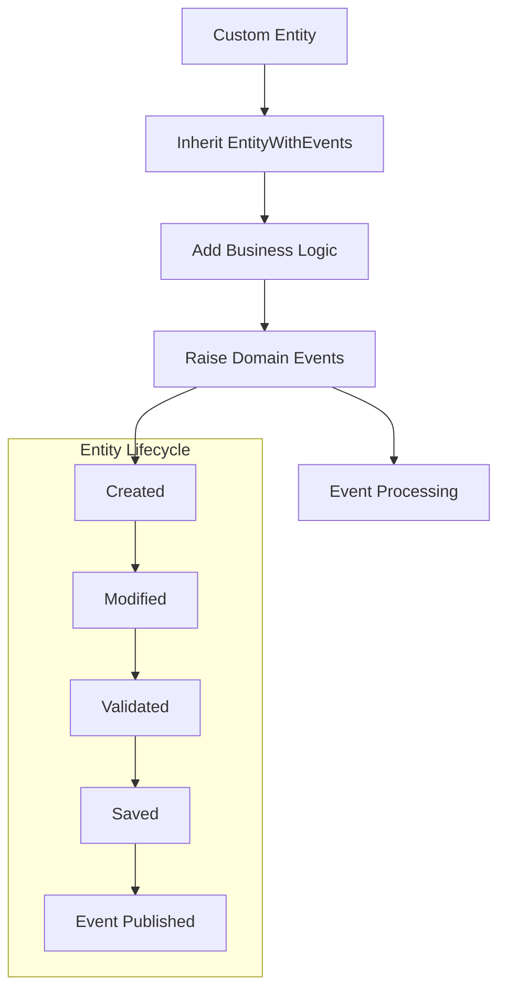

```csharp
public class MyEntity : EntityWithEvents
{
    public string Name { get; private set; }
    public decimal Value { get; private set; }
    public DateTime LastModified { get; private set; }
    
    public MyEntity(string name, decimal value)
    {
        Name = name ?? throw new ArgumentNullException(nameof(name));
        Value = value;
        LastModified = DateTime.UtcNow;
        
        // Raise domain event for entity creation
        AddEvent(new EntityCreated(Id, nameof(MyEntity), DateTime.UtcNow));
    }
    
    public void UpdateValue(decimal newValue, string updatedBy)
    {
        if (newValue == Value) return;
        
        var oldValue = Value;
        Value = newValue;
        LastModified = DateTime.UtcNow;
        
        // Raise domain event for value change
        AddEvent(new ValueUpdated(
            entityId: Id,
            entityType: nameof(MyEntity),
            oldValue: oldValue,
            newValue: newValue,
            updatedBy: updatedBy,
            timestamp: DateTime.UtcNow
        ));
    }
    
    public void MarkAsValidated(ValidationResult result)
    {
        AddEvent(new EntityValidated(
            entityId: Id,
            entityType: nameof(MyEntity),
            isValid: result.IsValid,
            validationDetails: result.ToString(),
            timestamp: DateTime.UtcNow
        ));
    }
}

// Custom domain events
public record EntityCreated(
    Guid EntityId, 
    string EntityType, 
    DateTime Timestamp
) : IValidationEvent;

public record ValueUpdated(
    Guid EntityId,
    string EntityType,
    object OldValue,
    object NewValue,
    string UpdatedBy,
    DateTime Timestamp
) : IValidationEvent, IAuditableEvent
{
    public Guid? AuditId { get; init; } = Guid.NewGuid();
    public string? AuditDetails { get; init; } = $"Value changed from {OldValue} to {NewValue} by {UpdatedBy}";
}
```

### 2. Advanced Validation Rule Implementations

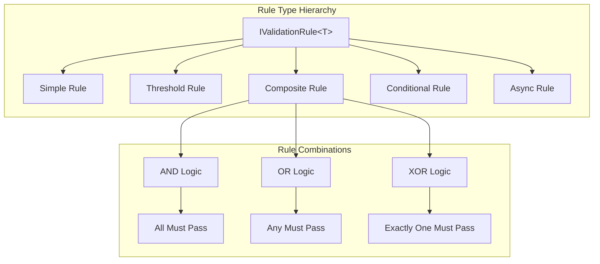

```csharp
// 1. Simple Named Rule
public class PositiveValueRule : IValidationRule<Item>
{
    public string Name => "PositiveValue";
    public string Description => "Value must be greater than zero";
    public ValidationSeverity Severity => ValidationSeverity.Error;
    
    public bool IsValid(Item item)
    {
        return item.Metric > 0;
    }
}

// 2. Parameterized Threshold Rule
public class ThresholdRule<T> : IValidationRule<T> where T : class
{
    private readonly Expression<Func<T, IComparable>> _propertyExpression;
    private readonly Func<T, IComparable> _compiledGetter;
    private readonly ThresholdType _thresholdType;
    private readonly IComparable _threshold;
    
    public string Name { get; }
    public string Description { get; }
    public ValidationSeverity Severity { get; }
    
    public ThresholdRule(
        Expression<Func<T, IComparable>> propertyExpression,
        ThresholdType thresholdType,
        IComparable threshold,
        string? name = null,
        ValidationSeverity severity = ValidationSeverity.Error)
    {
        _propertyExpression = propertyExpression;
        _compiledGetter = propertyExpression.Compile();
        _thresholdType = thresholdType;
        _threshold = threshold;
        
        Name = name ?? $"{GetPropertyName(propertyExpression)}_{thresholdType}_{threshold}";
        Description = $"Property {GetPropertyName(propertyExpression)} must be {thresholdType} {threshold}";
        Severity = severity;
    }
    
    public bool IsValid(T item)
    {
        var value = _compiledGetter(item);
        
        return _thresholdType switch
        {
            ThresholdType.GreaterThan => value.CompareTo(_threshold) > 0,
            ThresholdType.LessThan => value.CompareTo(_threshold) < 0,
            ThresholdType.GreaterThanOrEqual => value.CompareTo(_threshold) >= 0,
            ThresholdType.LessThanOrEqual => value.CompareTo(_threshold) <= 0,
            ThresholdType.Equal => value.CompareTo(_threshold) == 0,
            ThresholdType.NotEqual => value.CompareTo(_threshold) != 0,
            _ => throw new ArgumentOutOfRangeException()
        };
    }
    
    private static string GetPropertyName<TEntity>(Expression<Func<TEntity, IComparable>> expression)
    {
        return expression.Body switch
        {
            MemberExpression member => member.Member.Name,
            UnaryExpression unary when unary.Operand is MemberExpression member => member.Member.Name,
            _ => "UnknownProperty"
        };
    }
}

// 3. Composite Rule with Logic Operators
public class CompositeRule<T> : IValidationRule<T> where T : class
{
    private readonly List<IValidationRule<T>> _rules;
    private readonly LogicalOperator _operator;
    
    public string Name { get; }
    public string Description { get; }
    public ValidationSeverity Severity { get; }
    
    public CompositeRule(
        IEnumerable<IValidationRule<T>> rules, 
        LogicalOperator logicalOperator,
        string name,
        string? description = null)
    {
        _rules = rules.ToList();
        _operator = logicalOperator;
        Name = name;
        Description = description ?? $"Composite rule with {_operator} logic";
        Severity = _rules.Max(r => r.Severity);
    }
    
    public bool IsValid(T item)
    {
        return _operator switch
        {
            LogicalOperator.And => _rules.All(rule => rule.IsValid(item)),
            LogicalOperator.Or => _rules.Any(rule => rule.IsValid(item)),
            LogicalOperator.Xor => _rules.Count(rule => rule.IsValid(item)) == 1,
            LogicalOperator.Nand => !_rules.All(rule => rule.IsValid(item)),
            LogicalOperator.Nor => !_rules.Any(rule => rule.IsValid(item)),
            _ => throw new ArgumentOutOfRangeException()
        };
    }
}

public enum LogicalOperator
{
    And,    // All rules must pass
    Or,     // At least one rule must pass
    Xor,    // Exactly one rule must pass
    Nand,   // Not all rules pass
    Nor     // No rules pass
}

// 4. Conditional Rule (Rule applies only if condition is met)
public class ConditionalRule<T> : IValidationRule<T> where T : class
{
    private readonly Func<T, bool> _condition;
    private readonly IValidationRule<T> _rule;
    
    public string Name => $"Conditional_{_rule.Name}";
    public string Description => $"Apply {_rule.Description} when condition is met";
    public ValidationSeverity Severity => _rule.Severity;
    
    public ConditionalRule(Func<T, bool> condition, IValidationRule<T> rule)
    {
        _condition = condition ?? throw new ArgumentNullException(nameof(condition));
        _rule = rule ?? throw new ArgumentNullException(nameof(rule));
    }
    
    public bool IsValid(T item)
    {
        // If condition is not met, rule passes by default
        return !_condition(item) || _rule.IsValid(item);
    }
}
```

### 3. Building Comprehensive Validation Plans

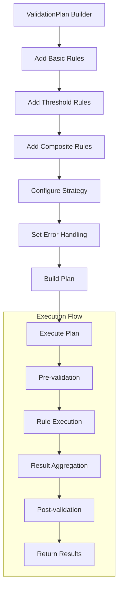

```csharp
public class ValidationPlanBuilder<T> where T : class
{
    private readonly List<IValidationRule<T>> _rules = new();
    private ValidationStrategy _strategy = ValidationStrategy.ContinueOnError;
    private ValidationSeverity _minimumSeverity = ValidationSeverity.Error;
    private TimeSpan _timeout = TimeSpan.FromMinutes(1);
    
    public ValidationPlanBuilder<T> AddRule(IValidationRule<T> rule)
    {
        _rules.Add(rule);
        return this;
    }
    
    public ValidationPlanBuilder<T> AddRule(string name, Func<T, bool> ruleFunc, 
        ValidationSeverity severity = ValidationSeverity.Error)
    {
        _rules.Add(new ValidationRule<T>(name, ruleFunc, severity));
        return this;
    }
    
    public ValidationPlanBuilder<T> AddThreshold<TProperty>(
        Expression<Func<T, TProperty>> property,
        ThresholdType type,
        TProperty threshold,
        string? name = null) where TProperty : IComparable<TProperty>
    {
        var rule = new ThresholdRule<T, TProperty>(property, type, threshold, name);
        _rules.Add(rule);
        return this;
    }
    
    public ValidationPlanBuilder<T> AddComposite(
        LogicalOperator logicalOperator,
        string name,
        params IValidationRule<T>[] rules)
    {
        var compositeRule = new CompositeRule<T>(rules, logicalOperator, name);
        _rules.Add(compositeRule);
        return this;
    }
    
    public ValidationPlanBuilder<T> WithStrategy(ValidationStrategy strategy)
    {
        _strategy = strategy;
        return this;
    }
    
    public ValidationPlanBuilder<T> WithMinimumSeverity(ValidationSeverity severity)
    {
        _minimumSeverity = severity;
        return this;
    }
    
    public ValidationPlanBuilder<T> WithTimeout(TimeSpan timeout)
    {
        _timeout = timeout;
        return this;
    }
    
    public ValidationPlan<T> Build()
    {
        return new ValidationPlan<T>
        {
            Name = $"ValidationPlan_{typeof(T).Name}",
            Rules = _rules.Where(r => r.Severity >= _minimumSeverity).ToList(),
            Strategy = _strategy,
            Timeout = _timeout,
            CreatedAt = DateTime.UtcNow
        };
    }
}

// Usage example
var validationPlan = new ValidationPlanBuilder<Item>()
    .AddRule("PositiveValue", item => item.Metric > 0)
    .AddRule("RequiredName", item => !string.IsNullOrWhiteSpace(item.Name))
    .AddThreshold(item => item.Metric, ThresholdType.LessThan, 1000, "MaxValue")
    .AddThreshold(item => item.CreatedDate, ThresholdType.GreaterThan, DateTime.Today.AddDays(-30))
    .AddComposite(LogicalOperator.Or, "SpecialCases",
        new ValidationRule<Item>("SpecialFlag", item => item.IsSpecial),
        new ValidationRule<Item>("AdminOverride", item => item.HasAdminOverride))
    .WithStrategy(ValidationStrategy.FailFast)
    .WithTimeout(TimeSpan.FromSeconds(30))
    .Build();
```

### 4. Advanced Event Processing Patterns

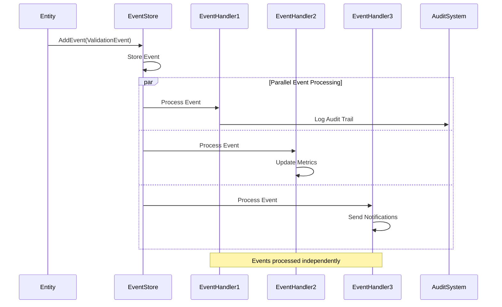

```csharp
// Event processing system
public class ValidationEventProcessor
{
    private readonly List<IValidationEventHandler> _handlers = new();
    
    public void AddHandler(IValidationEventHandler handler)
    {
        _handlers.Add(handler);
    }
    
    public async Task ProcessEventAsync(IValidationEvent validationEvent)
    {
        var tasks = _handlers.Select(handler => ProcessEventWithHandler(handler, validationEvent));
        await Task.WhenAll(tasks);
    }
    
    private async Task ProcessEventWithHandler(IValidationEventHandler handler, IValidationEvent validationEvent)
    {
        try
        {
            if (handler.CanHandle(validationEvent))
            {
                await handler.HandleAsync(validationEvent);
            }
        }
        catch (Exception ex)
        {
            // Log error but don't stop other handlers
            Console.WriteLine($"Error in handler {handler.GetType().Name}: {ex.Message}");
        }
    }
}

// Specialized event handlers
public class AuditEventHandler : IValidationEventHandler
{
    public bool CanHandle(IValidationEvent validationEvent)
    {
        return validationEvent is IAuditableEvent;
    }
    
    public async Task HandleAsync(IValidationEvent validationEvent)
    {
        if (validationEvent is IAuditableEvent auditableEvent)
        {
            await StoreAuditTrail(auditableEvent);
        }
    }
    
    private async Task StoreAuditTrail(IAuditableEvent auditableEvent)
    {
        var auditRecord = new AuditRecord
        {
            AuditId = auditableEvent.AuditId ?? Guid.NewGuid(),
            EntityId = auditableEvent.EntityId,
            EntityType = auditableEvent.EntityType,
            EventType = auditableEvent.GetType().Name,
            Details = auditableEvent.AuditDetails,
            Timestamp = auditableEvent.Timestamp,
            CreatedAt = DateTime.UtcNow
        };
        
        // Store in audit database
        await SaveAuditRecord(auditRecord);
    }
}

public class MetricsEventHandler : IValidationEventHandler
{
    private readonly Dictionary<string, int> _eventCounts = new();
    
    public bool CanHandle(IValidationEvent validationEvent) => true;
    
    public async Task HandleAsync(IValidationEvent validationEvent)
    {
        var eventType = validationEvent.GetType().Name;
        _eventCounts[eventType] = _eventCounts.GetValueOrDefault(eventType, 0) + 1;
        
        // Update metrics dashboard
        await UpdateMetrics(eventType, _eventCounts[eventType]);
    }
}
```

## Threshold Types

The `ThresholdType` enumeration supports various comparison operations:

- `GreaterThan` - Value must be greater than threshold
- `LessThan` - Value must be less than threshold  
- `GreaterThanOrEqual` - Value must be greater than or equal to threshold
- `LessThanOrEqual` - Value must be less than or equal to threshold
- `Equal` - Value must equal threshold
- `NotEqual` - Value must not equal threshold

## Validation Strategies

The domain supports multiple validation strategies:

- **Immediate** - Validate immediately upon rule evaluation
- **Deferred** - Defer validation until explicitly triggered
- **Batch** - Validate multiple items as a batch operation
- **Pipeline** - Validate through a series of pipeline stages

## Dependencies

This assembly has minimal dependencies to maintain clean domain boundaries:

- **No infrastructure dependencies** - Pure domain logic
- **No framework dependencies** - Framework-agnostic design
- **Minimal external references** - Only essential .NET types

## Design Principles

1. **Domain-Driven Design** - Clear separation of domain logic
2. **Event Sourcing** - Rich event model for audit and replay
3. **SOLID Principles** - Clean, maintainable, and extensible code
4. **Interface Segregation** - Focused, purpose-specific interfaces
5. **Dependency Inversion** - Abstractions over implementations

## Testing

Domain logic is fully unit testable with high coverage:

```bash
# Run domain-specific tests
dotnet test --filter "FullyQualifiedName~Validation.Domain"
```

The domain layer includes comprehensive tests for:
- Entity behavior and event raising
- Validation rule implementations
- Event interface compliance
- Validation plan execution
- Threshold validation logic

## Extension Points

The domain provides several extension points:

- **Custom Entities** - Implement `IEntityWithEvents` or inherit from `EntityWithEvents`
- **Custom Rules** - Implement `IValidationRule<T>` for entity-specific validation
- **Custom Events** - Implement `IValidationEvent` interfaces for new event types
- **Custom Strategies** - Implement validation strategy interfaces for new approaches
- **Custom Providers** - Implement `IValidationPlanProvider` for custom plan sources

This design ensures the domain remains extensible while maintaining clean boundaries and testability.