# Validation.Infrastructure

The infrastructure layer providing concrete implementations, messaging, persistence, observability, and cross-cutting concerns for the Unified Validation System with enterprise-grade reliability and performance.

## Infrastructure Architecture Overview

```mermaid
graph TB
    subgraph "Infrastructure Layer"
        A[Validation.Infrastructure]
        A --> B[🚀 Setup & Configuration]
        A --> C[📨 Messaging Infrastructure]
        A --> D[🛡️ Reliability Patterns]
        A --> E[📊 Metrics & Observability]
        A --> F[💾 Data Access Layer]
        A --> G[🔄 Pipeline Orchestration]
        A --> H[📋 Auditing System]
    end
    
    subgraph "Setup & Configuration"
        B --> B1[SetupValidationBuilder]
        B --> B2[Fluent Configuration API]
        B --> B3[Service Registration]
        B --> B4[Dependency Injection]
    end
    
    subgraph "Messaging Infrastructure"
        C --> C1[MassTransit Integration]
        C --> C2[Message Consumers]
        C --> C3[Event Publishers]
        C --> C4[Message Routing]
        C --> C5[Error Handling]
    end
    
    subgraph "Reliability Patterns"
        D --> D1[Circuit Breakers]
        D --> D2[Retry Policies]
        D --> D3[Timeout Management]
        D --> D4[Fault Tolerance]
        D --> D5[Health Checks]
    end
    
    subgraph "Metrics & Observability"
        E --> E1[Performance Metrics]
        E --> E2[OpenTelemetry]
        E --> E3[Distributed Tracing]
        E --> E4[Health Monitoring]
        E --> E5[Business Metrics]
    end
    
    style B fill:#e8f5e8
    style C fill:#e1f5fe
    style D fill:#f3e5f5
    style E fill:#fff3e0
    style F fill:#fce4ec
    style G fill:#f1f8e9
    style H fill:#e0f2f1
```



## Messaging Infrastructure Deep Dive

### MassTransit Integration Architecture


### Consumer Implementation Patterns


## Folder Structure

### 📁 `Auditing/`
Audit trail and compliance functionality.

*Provides comprehensive audit logging for all validation operations with retention policies and detailed tracking.*

### 📁 `DI/`
Dependency injection and service registration.

- **`ServiceCollectionExtensions.cs`** - ⭐ **Core service registration extensions**
- **`ValidationFlowConfig.cs`** - Configuration model for validation flows

### 📁 `Messaging/`
MassTransit-based messaging infrastructure.

- **`DeleteValidationConsumer.cs`** - Consumes delete validation messages
- **`ReliableDeleteValidationConsumer.cs`** - Delete validation with reliability patterns
- **`SaveCommitConsumer.cs`** - Consumes save commit messages
- **`SaveRequestedConsumer.cs`** - Consumes save requested messages
- **`SaveValidationConsumer.cs`** - Consumes save validation messages
- **`ValidationEventHub.cs`** - Central event publishing and subscription hub

### 📁 `Metrics/`
Metrics collection and processing.

- **`MetricsOrchestrator.cs`** - Orchestrates metrics collection and processing workflows

### 📁 `Observability/`
OpenTelemetry and monitoring integration.

*Provides distributed tracing, telemetry collection, and monitoring capabilities for production environments.*

### 📁 `Pipeline/`
Orchestration and workflow management.

- **`IPipelineOrchestrator.cs`** - Interface for pipeline orchestration
- **`MetricsPipelineOrchestrator.cs`** - Orchestrates metrics processing pipelines
- **`SummarisationPipelineOrchestrator.cs`** - Orchestrates summarization workflows
- **`ValidationFlowOrchestrator.cs`** - ⭐ **Main validation workflow orchestrator**

### 📁 `Reliability/`
Fault tolerance and resilience patterns.

- **`DeletePipelineReliabilityPolicy.cs`** - Reliability patterns for delete operations
- **`MassTransitReliability.cs`** - MassTransit-specific reliability implementations

### 📁 `Repositories/`
Data access implementations.

*Contains concrete repository implementations for Entity Framework, MongoDB, and other storage providers.*

### 📁 `Setup/`
System configuration and builder patterns.

- **`SetupValidationBuilder.cs`** - ⭐ **Main fluent configuration builder**
- **`ValidationSetupService.cs`** - Service for validation system initialization

### Root Files

- **`EnhancedManualValidatorService.cs`** - Enhanced validation service implementation
- **`ManualValidatorService.cs`** - Basic manual validation service
- **`SaveAudit.cs`** - Audit entity for save operations
- **`UnitOfWork.cs`** - Unit of Work pattern implementation

## Key Components

## Enhanced Validation Service Architecture

### Service Implementation Hierarchy


### Enhanced Validator Implementation Details

```csharp
public class EnhancedManualValidatorService : IEnhancedManualValidatorService
{
    private readonly ConcurrentDictionary<Type, NamedRuleCollection> _namedRules = new();
    private readonly IMetricsCollector _metricsCollector;
    private readonly ILogger<EnhancedManualValidatorService> _logger;
    private readonly ValidationConfiguration _configuration;
    
    public EnhancedManualValidatorService(
        IMetricsCollector metricsCollector,
        ILogger<EnhancedManualValidatorService> logger,
        ValidationConfiguration configuration)
    {
        _metricsCollector = metricsCollector;
        _logger = logger;
        _configuration = configuration;
    }
    
    public ValidationResult ValidateWithDetails<T>(T instance)
    {
        var stopwatch = Stopwatch.StartNew();
        var entityType = typeof(T);
        
        try
        {
            _logger.LogDebug("Starting validation for {EntityType}", entityType.Name);
            
            var rules = GetRulesForType<T>();
            var results = new List<RuleResult>();
            var failedRules = new List<string>();
            var errors = new List<ValidationError>();
            
            foreach (var rule in rules)
            {
                try
                {
                    var ruleStopwatch = Stopwatch.StartNew();
                    var isValid = rule.Rule(instance);
                    ruleStopwatch.Stop();
                    
                    var ruleResult = new RuleResult
                    {
                        RuleName = rule.Name,
                        IsValid = isValid,
                        ExecutionTime = ruleStopwatch.Elapsed,
                        Severity = rule.Severity
                    };
                    
                    results.Add(ruleResult);
                    
                    if (!isValid)
                    {
                        failedRules.Add(rule.Name);
                        errors.Add(new ValidationError
                        {
                            RuleName = rule.Name,
                            ErrorMessage = rule.ErrorMessage ?? $"Rule '{rule.Name}' failed",
                            Severity = rule.Severity,
                            PropertyName = rule.PropertyName,
                            AttemptedValue = GetPropertyValue(instance, rule.PropertyName)
                        });
                    }
                    
                    // Record rule-level metrics
                    _metricsCollector.RecordRuleExecution(rule.Name, isValid, ruleStopwatch.Elapsed);
                }
                catch (Exception ex)
                {
                    _logger.LogError(ex, "Error executing rule {RuleName} for {EntityType}", rule.Name, entityType.Name);
                    
                    failedRules.Add(rule.Name);
                    errors.Add(new ValidationError
                    {
                        RuleName = rule.Name,
                        ErrorMessage = $"Rule execution failed: {ex.Message}",
                        Severity = ValidationSeverity.Error,
                        Exception = ex
                    });
                }
            }
            
            stopwatch.Stop();
            
            var validationResult = new ValidationResult
            {
                IsValid = failedRules.Count == 0,
                FailedRules = failedRules,
                Errors = errors,
                RuleResults = results,
                ExecutionTime = stopwatch.Elapsed,
                ValidationTimestamp = DateTime.UtcNow,
                Metadata = new Dictionary<string, object>
                {
                    ["EntityType"] = entityType.Name,
                    ["RulesExecuted"] = results.Count,
                    ["TotalExecutionTime"] = stopwatch.Elapsed.TotalMilliseconds
                }
            };
            
            // Record overall validation metrics
            _metricsCollector.RecordValidation(entityType.Name, validationResult.IsValid, stopwatch.Elapsed);
            
            _logger.LogDebug("Validation completed for {EntityType}. Valid: {IsValid}, Rules: {RuleCount}, Time: {ExecutionTime}ms",
                entityType.Name, validationResult.IsValid, results.Count, stopwatch.Elapsed.TotalMilliseconds);
            
            return validationResult;
        }
        catch (Exception ex)
        {
            stopwatch.Stop();
            _logger.LogError(ex, "Fatal error during validation of {EntityType}", entityType.Name);
            
            return new ValidationResult
            {
                IsValid = false,
                FailedRules = ["SystemError"],
                Errors = [new ValidationError
                {
                    RuleName = "SystemError",
                    ErrorMessage = $"System error during validation: {ex.Message}",
                    Severity = ValidationSeverity.Critical,
                    Exception = ex
                }],
                ExecutionTime = stopwatch.Elapsed,
                ValidationTimestamp = DateTime.UtcNow
            };
        }
    }
    
    public async Task<ValidationResult> ValidateAsync<T>(T instance)
    {
        return await Task.Run(() => ValidateWithDetails(instance));
    }
    
    public void AddRule<T>(string name, Func<T, bool> rule)
    {
        var entityType = typeof(T);
        var ruleCollection = _namedRules.GetOrAdd(entityType, _ => new NamedRuleCollection());
        
        var namedRule = new NamedRule<T>
        {
            Name = name,
            Rule = rule,
            Severity = ValidationSeverity.Error,
            CreatedAt = DateTime.UtcNow
        };
        
        ruleCollection.AddRule(namedRule);
        
        _logger.LogDebug("Added rule {RuleName} for {EntityType}", name, entityType.Name);
        _metricsCollector.RecordRuleAdded(entityType.Name, name);
    }
}
```

## Reliability Patterns Implementation

### Circuit Breaker Pattern


### Comprehensive Reliability Policy Implementation

```csharp
public class DeletePipelineReliabilityPolicy : IReliabilityPolicy
{
    private readonly ReliabilityConfiguration _config;
    private readonly ILogger<DeletePipelineReliabilityPolicy> _logger;
    private readonly IMetricsCollector _metricsCollector;
    private readonly CircuitBreakerState _circuitBreakerState;
    private readonly SemaphoreSlim _semaphore;
    
    public DeletePipelineReliabilityPolicy(
        ReliabilityConfiguration config,
        ILogger<DeletePipelineReliabilityPolicy> logger,
        IMetricsCollector metricsCollector)
    {
        _config = config;
        _logger = logger;
        _metricsCollector = metricsCollector;
        _circuitBreakerState = new CircuitBreakerState(config.CircuitBreakerConfig);
        _semaphore = new SemaphoreSlim(config.MaxConcurrency, config.MaxConcurrency);
    }
    
    public async Task<T> ExecuteAsync<T>(
        Func<CancellationToken, Task<T>> operation,
        CancellationToken cancellationToken = default)
    {
        // Check circuit breaker state
        if (_circuitBreakerState.State == CircuitBreakerStateEnum.Open)
        {
            _logger.LogWarning("Circuit breaker is open, rejecting operation");
            _metricsCollector.RecordCircuitBreakerRejection();
            throw new CircuitBreakerOpenException("Circuit breaker is open");
        }
        
        // Acquire semaphore for concurrency control
        await _semaphore.WaitAsync(cancellationToken);
        
        try
        {
            // Apply timeout
            using var timeoutCts = CancellationTokenSource.CreateLinkedTokenSource(cancellationToken);
            timeoutCts.CancelAfter(_config.OperationTimeout);
            
            var attempt = 0;
            Exception lastException = null;
            
            while (attempt < _config.MaxRetries)
            {
                try
                {
                    attempt++;
                    _logger.LogDebug("Executing operation, attempt {Attempt}/{MaxRetries}", attempt, _config.MaxRetries);
                    
                    var stopwatch = Stopwatch.StartNew();
                    var result = await operation(timeoutCts.Token);
                    stopwatch.Stop();
                    
                    // Record success metrics
                    _metricsCollector.RecordOperationSuccess(stopwatch.Elapsed);
                    _circuitBreakerState.RecordSuccess();
                    
                    _logger.LogDebug("Operation succeeded on attempt {Attempt} in {Duration}ms", 
                        attempt, stopwatch.Elapsed.TotalMilliseconds);
                    
                    return result;
                }
                catch (OperationCanceledException) when (timeoutCts.Token.IsCancellationRequested)
                {
                    lastException = new TimeoutException($"Operation timed out after {_config.OperationTimeout}");
                    _logger.LogWarning("Operation timed out on attempt {Attempt}", attempt);
                    _metricsCollector.RecordOperationTimeout();
                }
                catch (Exception ex) when (IsRetryableException(ex))
                {
                    lastException = ex;
                    _logger.LogWarning(ex, "Retryable error on attempt {Attempt}: {Error}", attempt, ex.Message);
                    _metricsCollector.RecordRetryableError(ex.GetType().Name);
                    
                    if (attempt < _config.MaxRetries)
                    {
                        var delay = CalculateRetryDelay(attempt);
                        _logger.LogDebug("Waiting {Delay}ms before retry", delay.TotalMilliseconds);
                        await Task.Delay(delay, cancellationToken);
                    }
                }
                catch (Exception ex)
                {
                    // Non-retryable exception
                    _logger.LogError(ex, "Non-retryable error on attempt {Attempt}: {Error}", attempt, ex.Message);
                    _metricsCollector.RecordNonRetryableError(ex.GetType().Name);
                    _circuitBreakerState.RecordFailure();
                    throw;
                }
            }
            
            // All retries exhausted
            _logger.LogError("All retry attempts exhausted. Last error: {Error}", lastException?.Message);
            _metricsCollector.RecordOperationFailure();
            _circuitBreakerState.RecordFailure();
            
            throw new MaxRetriesExceededException($"Operation failed after {_config.MaxRetries} attempts", lastException);
        }
        finally
        {
            _semaphore.Release();
        }
    }
    
    private bool IsRetryableException(Exception exception)
    {
        return exception switch
        {
            SqlException sqlEx => IsRetryableSqlException(sqlEx),
            HttpRequestException => true,
            TaskCanceledException => true,
            SocketException => true,
            _ => _config.RetryableExceptions.Contains(exception.GetType())
        };
    }
    
    private TimeSpan CalculateRetryDelay(int attempt)
    {
        return _config.RetryStrategy switch
        {
            RetryStrategy.Linear => TimeSpan.FromMilliseconds(_config.BaseRetryDelay.TotalMilliseconds * attempt),
            RetryStrategy.Exponential => TimeSpan.FromMilliseconds(_config.BaseRetryDelay.TotalMilliseconds * Math.Pow(2, attempt - 1)),
            RetryStrategy.ExponentialWithJitter => AddJitter(TimeSpan.FromMilliseconds(_config.BaseRetryDelay.TotalMilliseconds * Math.Pow(2, attempt - 1))),
            _ => _config.BaseRetryDelay
        };
    }
    
    private TimeSpan AddJitter(TimeSpan delay)
    {
        var jitter = Random.Shared.NextDouble() * 0.1; // 10% jitter
        var jitterAmount = delay.TotalMilliseconds * jitter;
        return TimeSpan.FromMilliseconds(delay.TotalMilliseconds + jitterAmount);
    }
}

### MongoDB Integration Implementation

```csharp
public class MongoValidationRepository<T> : IRepository<T> where T : class, IEntity
{
    private readonly IMongoCollection<T> _collection;
    private readonly ILogger<MongoValidationRepository<T>> _logger;
    private readonly IMetricsCollector _metricsCollector;
    
    public MongoValidationRepository(
        IMongoDatabase database,
        ILogger<MongoValidationRepository<T>> logger,
        IMetricsCollector metricsCollector)
    {
        _collection = database.GetCollection<T>(GetCollectionName());
        _logger = logger;
        _metricsCollector = metricsCollector;
    }
    
    public async Task<T> GetByIdAsync(Guid id)
    {
        var stopwatch = Stopwatch.StartNew();
        
        try
        {
            var filter = Builders<T>.Filter.Eq(entity => entity.Id, id);
            var result = await _collection.Find(filter).FirstOrDefaultAsync();
            
            stopwatch.Stop();
            _metricsCollector.RecordDatabaseOperation("GetById", true, stopwatch.Elapsed);
            
            return result;
        }
        catch (Exception ex)
        {
            stopwatch.Stop();
            _metricsCollector.RecordDatabaseOperation("GetById", false, stopwatch.Elapsed);
            _logger.LogError(ex, "Error getting entity by ID {Id}", id);
            throw;
        }
    }
    
    public async Task<IEnumerable<T>> FindAsync(Expression<Func<T, bool>> predicate)
    {
        var stopwatch = Stopwatch.StartNew();
        
        try
        {
            var result = await _collection.Find(predicate).ToListAsync();
            
            stopwatch.Stop();
            _metricsCollector.RecordDatabaseOperation("Find", true, stopwatch.Elapsed);
            
            return result;
        }
        catch (Exception ex)
        {
            stopwatch.Stop();
            _metricsCollector.RecordDatabaseOperation("Find", false, stopwatch.Elapsed);
            _logger.LogError(ex, "Error finding entities with predicate");
            throw;
        }
    }
    
    public async Task<T> SaveAsync(T entity)
    {
        var stopwatch = Stopwatch.StartNew();
        
        try
        {
            var options = new ReplaceOptions { IsUpsert = true };
            var filter = Builders<T>.Filter.Eq(e => e.Id, entity.Id);
            
            await _collection.ReplaceOneAsync(filter, entity, options);
            
            stopwatch.Stop();
            _metricsCollector.RecordDatabaseOperation("Save", true, stopwatch.Elapsed);
            
            return entity;
        }
        catch (Exception ex)
        {
            stopwatch.Stop();
            _metricsCollector.RecordDatabaseOperation("Save", false, stopwatch.Elapsed);
            _logger.LogError(ex, "Error saving entity {EntityId}", entity.Id);
            throw;
        }
    }
    
    private string GetCollectionName()
    {
        return typeof(T).Name.ToLowerInvariant() + "s";
    }
}
```

## Configuration and Service Registration

### Comprehensive Service Registration


### Advanced Configuration Implementation

```csharp
public static class ServiceCollectionExtensions
{
    public static SetupValidationBuilder AddSetupValidation(this IServiceCollection services)
    {
        return new SetupValidationBuilder(services);
    }
    
    public static IServiceCollection AddValidationInfrastructure(
        this IServiceCollection services,
        Action<ValidationInfrastructureOptions>? configure = null)
    {
        var options = new ValidationInfrastructureOptions();
        configure?.Invoke(options);
        
        services.AddSingleton(options);
        
        // Core validation services
        RegisterCoreServices(services, options);
        
        // Messaging infrastructure
        RegisterMessagingServices(services, options);
        
        // Reliability patterns
        RegisterReliabilityServices(services, options);
        
        // Metrics and observability
        RegisterObservabilityServices(services, options);
        
        // Storage implementations
        RegisterStorageServices(services, options);
        
        return services;
    }
    
    private static void RegisterCoreServices(IServiceCollection services, ValidationInfrastructureOptions options)
    {
        services.AddScoped<IManualValidatorService, ManualValidatorService>();
        services.AddScoped<IEnhancedManualValidatorService, EnhancedManualValidatorService>();
        services.AddScoped<ValidationFlowOrchestrator>();
        
        // Register validation plans
        services.AddSingleton<IValidationPlanProvider, InMemoryValidationPlanProvider>();
        
        // Register rule providers
        services.AddScoped(typeof(IValidationRule<>), typeof(ValidationRule<>));
    }
    
    private static void RegisterMessagingServices(IServiceCollection services, ValidationInfrastructureOptions options)
    {
        services.AddMassTransit(x =>
        {
            // Register consumers
            x.AddConsumer<SaveValidationConsumer>();
            x.AddConsumer<DeleteValidationConsumer>();
            x.AddConsumer<SaveCommitConsumer>();
            x.AddConsumer<BatchSaveValidationConsumer>();
            
            // Configure transport
            if (options.UseInMemoryTransport)
            {
                x.UsingInMemory((context, cfg) =>
                {
                    cfg.ConfigureEndpoints(context);
                });
            }
            else if (!string.IsNullOrEmpty(options.RabbitMqConnectionString))
            {
                x.UsingRabbitMq((context, cfg) =>
                {
                    cfg.Host(options.RabbitMqConnectionString);
                    cfg.ConfigureEndpoints(context);
                });
            }
        });
        
        services.AddScoped<ValidationEventHub>();
    }
    
    private static void RegisterReliabilityServices(IServiceCollection services, ValidationInfrastructureOptions options)
    {
        services.AddSingleton<IReliabilityPolicy, DeletePipelineReliabilityPolicy>();
        services.Configure<ReliabilityConfiguration>(config =>
        {
            config.MaxRetries = options.MaxRetries;
            config.BaseRetryDelay = options.RetryDelay;
            config.RetryStrategy = options.RetryStrategy;
            config.CircuitBreakerConfig = options.CircuitBreakerConfig;
        });
        
        // Health checks
        services.AddHealthChecks()
            .AddCheck<ValidationSystemHealthCheck>("validation-system")
            .AddCheck<DatabaseHealthCheck>("database")
            .AddCheck<MessageBusHealthCheck>("message-bus");
    }
    
    private static void RegisterObservabilityServices(IServiceCollection services, ValidationInfrastructureOptions options)
    {
        services.AddSingleton<IMetricsCollector, MetricsCollector>();
        services.AddSingleton<MetricsOrchestrator>();
        
        if (options.EnableOpenTelemetry)
        {
            services.AddOpenTelemetry()
                .WithTracing(builder => builder
                    .AddSource("ValidationSystem")
                    .AddAspNetCoreInstrumentation()
                    .AddHttpClientInstrumentation()
                    .AddEntityFrameworkCoreInstrumentation())
                .WithMetrics(builder => builder
                    .AddMeter("ValidationSystem.Metrics")
                    .AddAspNetCoreInstrumentation()
                    .AddHttpClientInstrumentation());
        }
    }
    
    private static void RegisterStorageServices(IServiceCollection services, ValidationInfrastructureOptions options)
    {
        if (options.UseEntityFramework)
        {
            services.AddScoped(typeof(IRepository<>), typeof(EfRepository<>));
            services.AddScoped<IUnitOfWork, EfUnitOfWork>();
        }
        
        if (options.UseMongoDB)
        {
            services.AddSingleton<IMongoClient>(provider =>
                new MongoClient(options.MongoConnectionString));
            
            services.AddScoped<IMongoDatabase>(provider =>
                provider.GetService<IMongoClient>()
                    .GetDatabase(options.MongoDatabaseName));
            
            services.AddScoped(typeof(IRepository<>), typeof(MongoValidationRepository<>));
        }
    }
}

public class ValidationInfrastructureOptions
{
    public bool UseInMemoryTransport { get; set; } = true;
    public string? RabbitMqConnectionString { get; set; }
    public bool UseEntityFramework { get; set; } = true;
    public bool UseMongoDB { get; set; } = false;
    public string? MongoConnectionString { get; set; }
    public string? MongoDatabaseName { get; set; }
    public int MaxRetries { get; set; } = 3;
    public TimeSpan RetryDelay { get; set; } = TimeSpan.FromSeconds(1);
    public RetryStrategy RetryStrategy { get; set; } = RetryStrategy.Exponential;
    public CircuitBreakerConfiguration CircuitBreakerConfig { get; set; } = new();
    public bool EnableOpenTelemetry { get; set; } = true;
    public bool EnableDetailedMetrics { get; set; } = false;
    public TimeSpan MetricsProcessingInterval { get; set; } = TimeSpan.FromMinutes(1);
}
```

## Performance Optimization and Best Practices

### Performance Monitoring Dashboard


### Infrastructure Testing Patterns

```csharp
[Test]
public async Task ValidationFlowOrchestrator_SaveOperation_CompletesSuccessfully()
{
    // Arrange
    var services = new ServiceCollection();
    services.AddValidationInfrastructure(options =>
    {
        options.UseInMemoryTransport = true;
        options.UseEntityFramework = false;
        options.EnableOpenTelemetry = false;
    });
    
    services.AddDbContext<TestDbContext>(options => 
        options.UseInMemoryDatabase($"test-{Guid.NewGuid()}"));
    
    var provider = services.BuildServiceProvider();
    var orchestrator = provider.GetRequiredService<ValidationFlowOrchestrator>();
    
    // Act
    var item = new Item(100) { Name = "Test Item" };
    var result = await orchestrator.ProcessSaveAsync(item);
    
    // Assert
    Assert.IsTrue(result.IsValid);
    Assert.IsEmpty(result.Errors);
    Assert.IsNotNull(result.ValidationTimestamp);
}
```

This comprehensive infrastructure layer provides enterprise-grade reliability, performance, and observability while maintaining clean architecture principles and extensive testability for production validation scenarios.
```

## Metrics and Observability Architecture

### Metrics Collection Pipeline


## Messaging Architecture

### Message Flow

```
Client Request → ValidationFlowOrchestrator → MassTransit → Consumers → Database → Events
```

### Message Types

#### Save Operations
1. **SaveRequested** → Triggers validation workflow
2. **SaveValidated** → Validation completed, ready for commit
3. **SaveCommitRequested** → Commit operation requested
4. **SaveCommitCompleted** → Commit operation finished
5. **SaveCommitFault** → Commit operation failed

#### Delete Operations
1. **DeleteRequested** → Triggers delete validation
2. **DeleteValidated** → Delete validation passed
3. **DeleteRejected** → Delete validation failed
4. **DeleteCommitRequested** → Delete commit requested
5. **DeleteCommitCompleted** → Delete commit finished

### Consumer Pattern

```csharp
public class SaveRequestedConsumer : IConsumer<SaveRequested>
{
    public async Task Consume(ConsumeContext<SaveRequested> context)
    {
        var message = context.Message;
        
        // Perform validation logic
        var validationResult = await _validator.ValidateAsync(message.Entity);
        
        if (validationResult.IsValid)
        {
            await context.Publish(new SaveValidated(message.EntityId, message.AuditId));
        }
        else
        {
            await context.Publish(new ValidationOperationFailed(
                message.EntityId, "Save", validationResult.ErrorMessage));
        }
    }
}
```

## Reliability Patterns

### Circuit Breaker
Prevents cascade failures by temporarily stopping operations to failing services:

```csharp
var policy = DeletePipelineReliabilityPolicy.Create()
    .WithCircuitBreaker(
        threshold: 5,           // Open after 5 failures
        timeout: TimeSpan.FromMinutes(1))  // Stay open for 1 minute
    .Build();
```

### Retry Policy
Automatically retries failed operations with configurable backoff:

```csharp
.ConfigureReliability(reliability => reliability
    .WithMaxRetries(3)
    .WithRetryDelay(TimeSpan.FromSeconds(2))
    .WithExponentialBackoff())
```

### Timeout Management
Ensures operations don't run indefinitely:

```csharp
.WithValidationTimeout(TimeSpan.FromMinutes(5))
.WithOperationTimeout(TimeSpan.FromMinutes(10))
```

## Metrics and Observability

### Metrics Collection

The system collects comprehensive metrics:

- **Validation Performance**: Execution times, success rates
- **Message Processing**: Throughput, latency, error rates  
- **Resource Usage**: Memory, CPU, database connections
- **Business Metrics**: Validation rule hit rates, entity counts

```csharp
.ConfigureMetrics(metrics => metrics
    .WithProcessingInterval(TimeSpan.FromMinutes(1))
    .EnableDetailedMetrics(true)
    .WithCustomCollector<MyMetricsCollector>()
    .WithRetentionPeriod(TimeSpan.FromDays(30)))
```

### OpenTelemetry Integration

Full distributed tracing and telemetry:

- **Tracing**: End-to-end request tracing
- **Metrics**: Performance counters and business metrics
- **Logging**: Structured logging with correlation
- **Health Checks**: System health monitoring

## Storage Implementations

### Entity Framework Integration

```csharp
.UseEntityFramework<MyDbContext>(options => 
    options.UseSqlServer(connectionString))
```

Features:
- Full EF Core integration
- Transaction management
- Migration support
- Multiple database providers
- Connection pooling

### MongoDB Integration

```csharp
.UseMongoDB("mongodb://localhost:27017", "validation")
```

Features:
- Native MongoDB support
- Document-based storage
- GridFS for large documents
- Aggregation pipeline support
- Automatic indexing

## Configuration Options

### ValidationFlowConfig

Comprehensive configuration for validation flows:

```csharp
public class ValidationFlowConfig
{
    public bool SaveValidation { get; set; } = true;
    public bool SaveCommit { get; set; } = true;
    public bool DeleteValidation { get; set; } = true;
    public bool DeleteCommit { get; set; } = true;
    public bool SoftDeleteSupport { get; set; } = false;
    public TimeSpan? ValidationTimeout { get; set; }
    public TimeSpan? OperationTimeout { get; set; }
    public int? MaxRetryAttempts { get; set; } = 3;
    public TimeSpan? RetryDelay { get; set; }
    public bool EnableAuditing { get; set; } = true;
    public bool EnableMetrics { get; set; } = true;
    public bool EnableReliability { get; set; } = true;
    public string? EntityType { get; set; }
    public List<ThresholdConfig> Thresholds { get; set; } = new();
}
```

### Service Registration

The infrastructure provides comprehensive service registration:

```csharp
public static class ServiceCollectionExtensions
{
    public static IServiceCollection AddValidationInfrastructure(this IServiceCollection services)
    {
        services.AddMassTransit(x => { /* MassTransit configuration */ });
        services.AddScoped<IEnhancedManualValidatorService, EnhancedManualValidatorService>();
        services.AddScoped<ValidationFlowOrchestrator>();
        services.AddSingleton<MetricsOrchestrator>();
        // ... additional registrations
        return services;
    }
}
```

## Unit of Work Pattern

Manages transactions across multiple repositories:

```csharp
public class UnitOfWork : IUnitOfWork
{
    public async Task<int> SaveChangesAsync()
    {
        // Begin transaction
        using var transaction = await _context.Database.BeginTransactionAsync();
        
        try
        {
            var result = await _context.SaveChangesAsync();
            await transaction.CommitAsync();
            return result;
        }
        catch
        {
            await transaction.RollbackAsync();
            throw;
        }
    }
}
```

## Usage Examples

### Basic Setup

```csharp
services.AddValidationInfrastructure()
    .AddScoped<IMyRepository, MyRepository>()
    .AddDbContext<MyDbContext>(options => 
        options.UseSqlServer(connectionString));
```

### Advanced Configuration

```csharp
services.AddSetupValidation()
    .UseEntityFramework<MyDbContext>()
    
    // Configure validation flows
    .AddValidationFlow<Item>(flow => flow
        .EnableSaveValidation()
        .EnableDeleteValidation()
        .EnableSoftDelete()
        .WithValidationTimeout(TimeSpan.FromMinutes(5))
        .EnableAuditing())
    
    // Configure infrastructure
    .ConfigureMetrics(metrics => metrics
        .WithProcessingInterval(TimeSpan.FromMinutes(1))
        .EnableDetailedMetrics())
    
    .ConfigureReliability(reliability => reliability
        .WithMaxRetries(3)
        .WithCircuitBreaker(5, TimeSpan.FromMinutes(1)))
    
    .ConfigureAuditing(auditing => auditing
        .WithRetentionPeriod(TimeSpan.FromDays(365))
        .EnableDetailedAuditing())
    
    .Build();
```

### Custom Consumers

```csharp
public class CustomValidationConsumer : IConsumer<CustomValidationRequested>
{
    private readonly IValidator<MyEntity> _validator;
    
    public async Task Consume(ConsumeContext<CustomValidationRequested> context)
    {
        var result = await _validator.ValidateAsync(context.Message.Entity);
        
        if (result.IsValid)
        {
            await context.Publish(new CustomValidationCompleted(context.Message.EntityId));
        }
        else
        {
            await context.Publish(new CustomValidationFailed(
                context.Message.EntityId, result.Errors));
        }
    }
}
```

## Dependencies

Key infrastructure dependencies:

- **MassTransit** - Message bus and consumer framework
- **Entity Framework Core** - ORM and database access
- **MongoDB.Driver** - MongoDB client and operations
- **OpenTelemetry** - Observability and telemetry
- **Microsoft.Extensions.***- Configuration, DI, logging, hosting

## Performance Considerations

1. **Message Processing**: Parallel consumer processing with backpressure
2. **Database Access**: Connection pooling and query optimization
3. **Memory Management**: Efficient object lifecycle management  
4. **Caching**: Strategic caching of validation rules and configurations
5. **Async/Await**: Proper async patterns throughout

## Testing

Infrastructure components are thoroughly tested:

```bash
# Run infrastructure tests
dotnet test --filter "FullyQualifiedName~Validation.Infrastructure"
```

Test categories:
- **Integration Tests**: Full system integration with real databases
- **Consumer Tests**: Message consumer behavior and error handling
- **Reliability Tests**: Circuit breaker and retry functionality
- **Performance Tests**: Load testing and throughput validation

## Monitoring and Diagnostics

Built-in monitoring capabilities:

- **Health Checks**: Database connectivity, message bus health
- **Performance Counters**: Custom counters for validation metrics
- **Distributed Tracing**: End-to-end request correlation
- **Error Tracking**: Comprehensive error logging and alerting

This infrastructure layer provides a robust, scalable foundation for enterprise validation scenarios while maintaining clean architecture principles and high testability.