# ValidationFlow.Messages

Message contracts and communication patterns for the Unified Validation System's distributed messaging infrastructure.

## Overview

This assembly defines all message types, contracts, and communication patterns used throughout the validation system. It provides a comprehensive set of messages for save operations, delete operations, soft delete workflows, and unified validation scenarios with complete audit trails and error handling.

## Message Architecture

### Complete Message Flow Overview

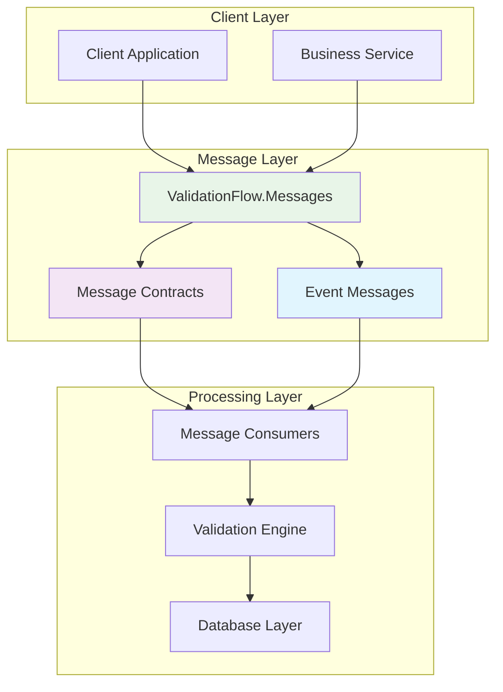

### Message Categories

The system supports four main categories of messages with complete workflows:

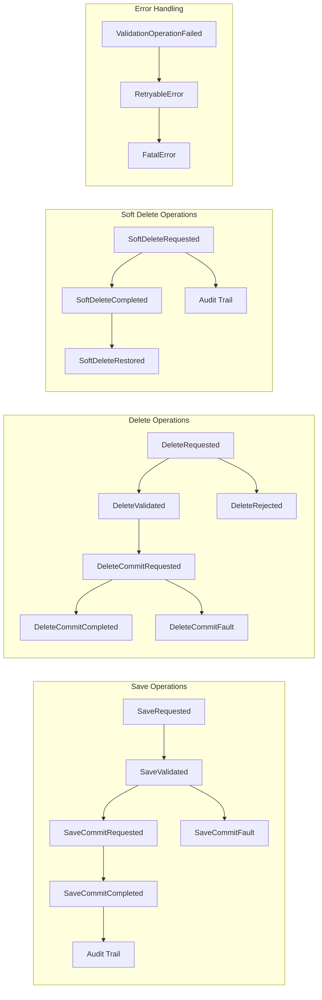

## Detailed Message Workflows

### 1. Save Operation Workflow

Complete save operation with validation, commit, and error handling:

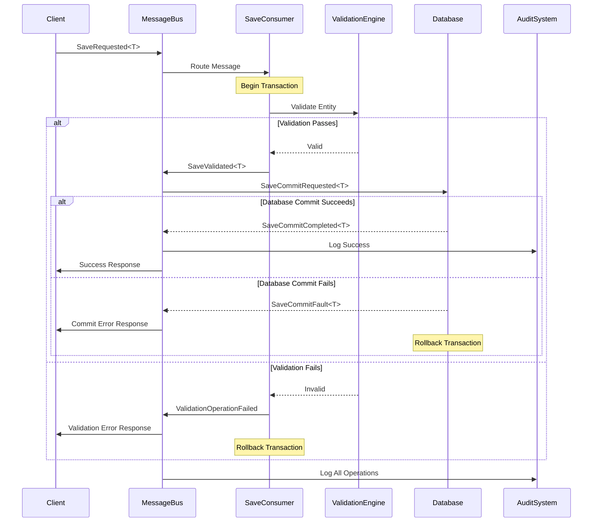

### 2. Delete Operation Workflow

Comprehensive delete validation with safety checks:

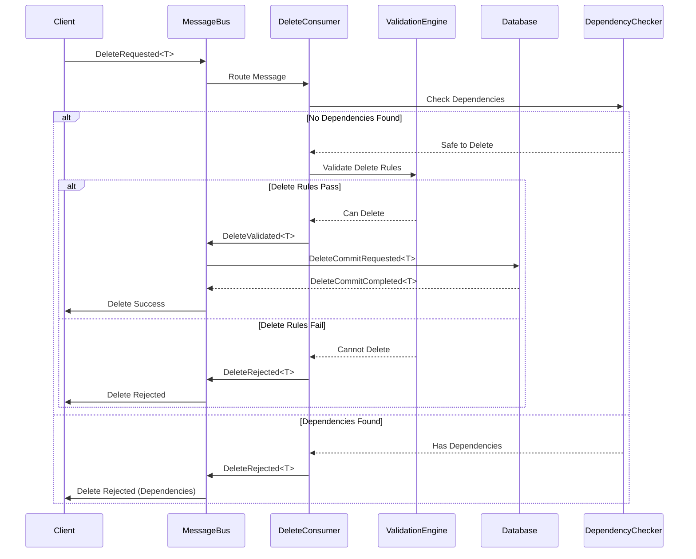

### 3. Soft Delete Workflow

Soft delete with restoration capabilities:

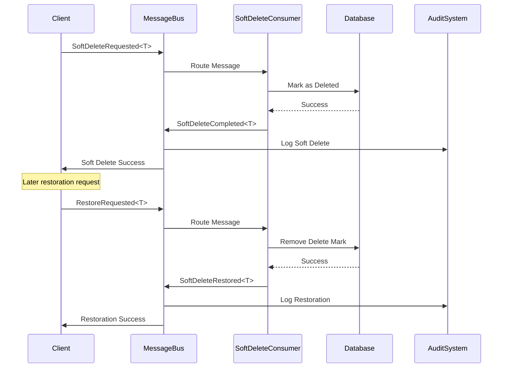

## Message Structure and Contracts

### Generic Message Pattern

All messages follow a consistent structure for type safety and serialization:

```csharp
public record MessageBase<T> where T : class
{
    public Guid EntityId { get; init; }
    public T Entity { get; init; }
    public Guid? AuditId { get; init; }
    public DateTime? Timestamp { get; init; }
    public string? CorrelationId { get; init; }
    public string? CausationId { get; init; }
    public Dictionary<string, object>? Metadata { get; init; }
}
```

### Message Correlation and Tracing

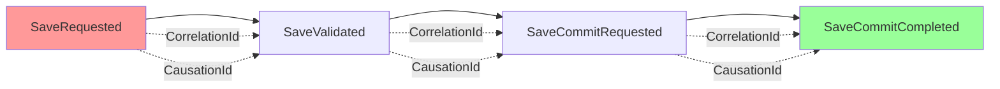

## Folder Structure

### Root Files

- **`SaveMessages.cs`** - ⭐ **Complete message definitions for save operations**
- **`ValidationFlow.Messages.csproj`** - Project configuration file

## Message Categories

### 1. Save Operation Messages

Complete workflow for save validation and commit operations:

#### Save Validation Flow
```csharp
SaveRequested<T>           // Initial save request with entity data
↓
SaveValidated<T>           // Validation completed successfully
↓  
SaveCommitRequested<T>     // Ready to commit the save operation
↓
SaveCommitCompleted<T>     // Save operation completed successfully
```

#### Error Handling
```csharp
SaveCommitFault<T>         // Save commit operation failed
ValidationOperationFailed   // General validation operation failure
```

### 2. Delete Operation Messages

Complete workflow for delete validation and commit operations:

#### Delete Validation Flow
```csharp
DeleteRequested<T>         // Initial delete request
↓
DeleteValidated<T>         // Delete validation passed
↓
DeleteCommitRequested<T>   // Ready to commit the delete
↓  
DeleteCommitCompleted<T>   // Delete operation completed
```

#### Delete Rejection Flow
```csharp
DeleteRequested<T>         // Initial delete request
↓
DeleteRejected<T>          // Delete validation failed
```

#### Error Handling
```csharp
DeleteCommitFault<T>       // Delete commit operation failed
```

### 3. Soft Delete Messages

Specialized messages for soft delete operations:

```csharp
SoftDeleteRequested<T>     // Soft delete operation requested
SoftDeleteCompleted<T>     // Soft delete operation completed
SoftDeleteRestored<T>      // Soft delete operation restored
```

## Message Structure

### Generic Messages

All messages follow a consistent pattern with generic type support:

```csharp
public record SaveRequested<T>(
    Guid EntityId,
    T Entity,
    Guid? AuditId = null,
    DateTime? RequestedAt = null,
    string? RequestedBy = null
) where T : class;
```

### Non-Generic Messages

Legacy and interoperability messages:

```csharp
public record SaveRequested(
    Guid EntityId,
    object Entity,
    string EntityType,
    Guid? AuditId = null
);
```

## Key Message Types

## Key Message Types

### SaveRequested<T>
Initiates a save validation workflow with comprehensive context information.

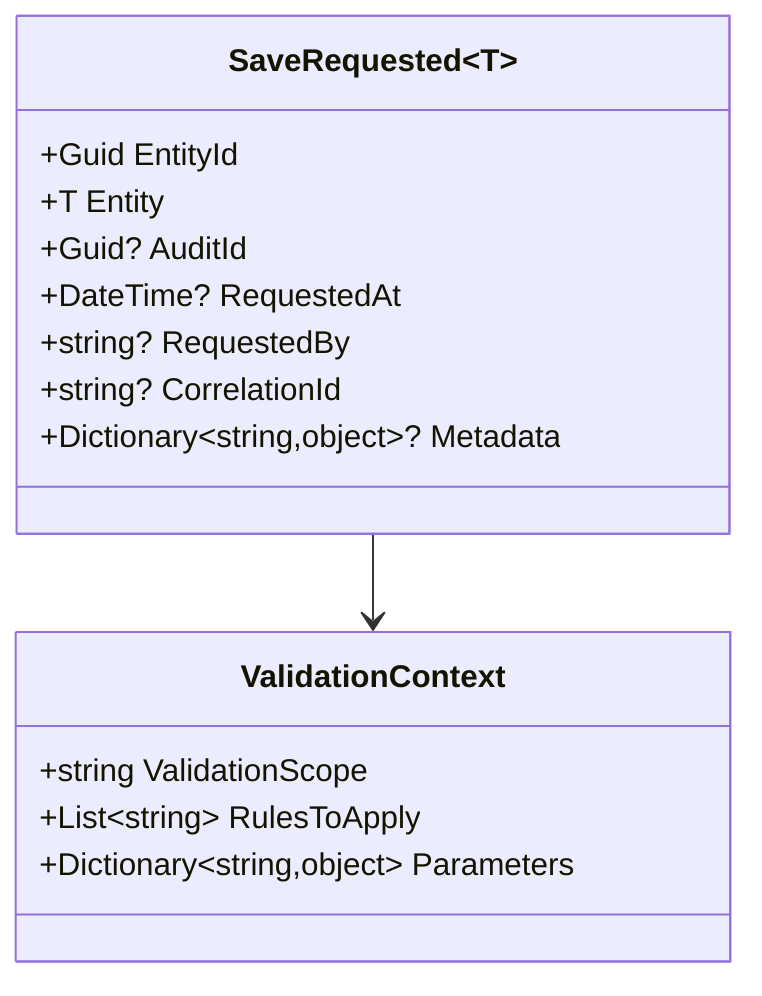

**Properties:**
- `EntityId` - Unique identifier for the entity
- `Entity` - The entity data to be saved
- `AuditId` - Optional audit trail identifier
- `RequestedAt` - Timestamp of the request
- `RequestedBy` - User or system making the request
- `CorrelationId` - For tracking related operations
- `Metadata` - Additional context information

**Usage:**
```csharp
var message = new SaveRequested<Item>(
    entityId: Guid.NewGuid(),
    entity: new Item(100),
    auditId: Guid.NewGuid(),
    requestedAt: DateTime.UtcNow,
    requestedBy: "user@example.com",
    correlationId: "workflow-123",
    metadata: new Dictionary<string, object>
    {
        ["ValidationScope"] = "FullValidation",
        ["Priority"] = "High"
    }
);

await bus.Publish(message);
```

### SaveValidated<T>
Indicates successful completion of save validation with detailed results.

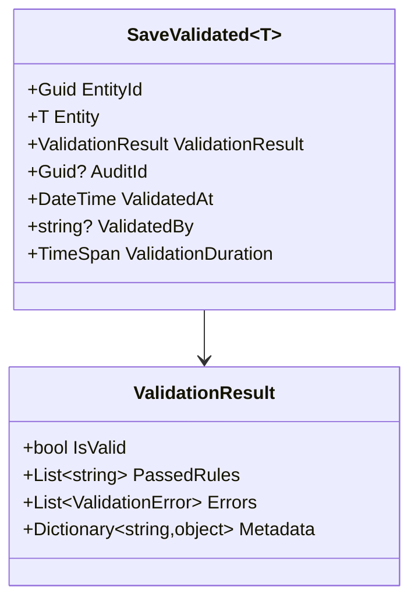

**Usage:**
```csharp
var message = new SaveValidated<Item>(
    entityId: item.Id,
    entity: item,
    validationResult: new ValidationResult 
    { 
        IsValid = true, 
        PassedRules = ["PositiveValue", "ReasonableRange"],
        ValidationDuration = TimeSpan.FromMilliseconds(50)
    },
    auditId: auditId,
    validatedAt: DateTime.UtcNow,
    validatedBy: "ValidationEngine"
);

await context.Publish(message);
```

### DeleteRequested<T>
Initiates a delete validation workflow with safety checks.

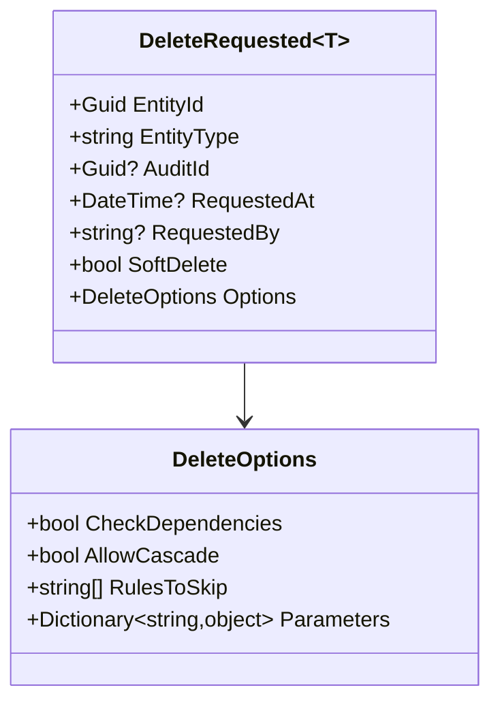

**Usage:**
```csharp
var message = new DeleteRequested<Item>(
    entityId: itemId,
    entityType: "Item",
    auditId: Guid.NewGuid(),
    requestedAt: DateTime.UtcNow,
    requestedBy: "admin@example.com",
    softDelete: true,
    options: new DeleteOptions
    {
        CheckDependencies = true,
        AllowCascade = false,
        RulesToSkip = ["LegacyRule"]
    }
);

await bus.Publish(message);
```

## Message Routing and Topology

### Topic-Based Routing Strategy

```mermaid
graph TD
    subgraph "Message Topics"
        A[validation.save.*]
        B[validation.delete.*]
        C[validation.softdelete.*]
        D[validation.error.*]
    end
    
    subgraph "Save Topics"
        A --> A1[validation.save.requested]
        A --> A2[validation.save.validated]
        A --> A3[validation.save.committed]
        A --> A4[validation.save.failed]
    end
    
    subgraph "Delete Topics"
        B --> B1[validation.delete.requested]
        B --> B2[validation.delete.validated]
        B --> B3[validation.delete.rejected]
        B --> B4[validation.delete.committed]
    end
    
    subgraph "Soft Delete Topics"
        C --> C1[validation.softdelete.requested]
        C --> C2[validation.softdelete.completed]
        C --> C3[validation.softdelete.restored]
    end
    
    subgraph "Error Topics"
        D --> D1[validation.error.temporary]
        D --> D2[validation.error.permanent]
        D --> D3[validation.error.retry]
    end
```

### Consumer Registration Pattern

```csharp
services.AddMassTransit(x =>
{
    // Register message consumers
    x.AddConsumer<SaveValidationConsumer>();
    x.AddConsumer<DeleteValidationConsumer>();
    x.AddConsumer<SoftDeleteConsumer>();
    x.AddConsumer<ErrorHandlingConsumer>();
    
    x.UsingRabbitMq((context, cfg) =>
    {
        cfg.Host("rabbitmq://localhost");
        
        // Configure topic exchanges
        cfg.Message<SaveRequested<Item>>(x => x.SetEntityName("validation.save.requested"));
        cfg.Message<SaveValidated<Item>>(x => x.SetEntityName("validation.save.validated"));
        cfg.Message<DeleteRequested<Item>>(x => x.SetEntityName("validation.delete.requested"));
        
        cfg.ConfigureEndpoints(context);
    });
});
```

## Error Handling Messages

### Comprehensive Error Message Hierarchy

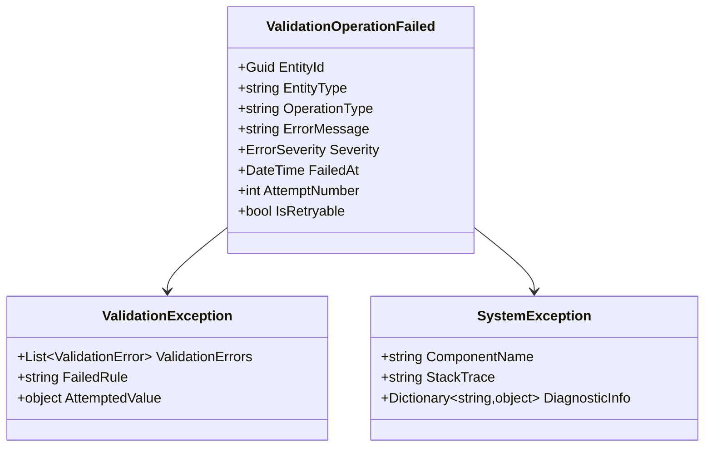

### Error Severity Levels

```csharp
public enum ErrorSeverity
{
    Info,           // Informational, no action required
    Warning,        // Warning, operation may continue
    Error,          // Error, operation should be retried
    Critical,       // Critical error, manual intervention required
    Fatal           // Fatal error, system shutdown required
}
```

### Error Message Examples

```csharp
// Validation error
var validationError = new ValidationOperationFailed(
    entityId: item.Id,
    entityType: "Item",
    operationType: "Save",
    errorMessage: "Validation rule 'PositiveValue' failed",
    severity: ErrorSeverity.Error,
    failedAt: DateTime.UtcNow,
    attemptNumber: 1,
    isRetryable: false
);

// System error
var systemError = new ValidationOperationFailed(
    entityId: item.Id,
    entityType: "Item", 
    operationType: "Save",
    errorMessage: "Database connection timeout",
    severity: ErrorSeverity.Critical,
    failedAt: DateTime.UtcNow,
    attemptNumber: 3,
    isRetryable: true
);
```

## Message Serialization and Versioning

### JSON Serialization Configuration

```csharp
var options = new JsonSerializerOptions
{
    PropertyNamingPolicy = JsonNamingPolicy.CamelCase,
    WriteIndented = true,
    DefaultIgnoreCondition = JsonIgnoreCondition.WhenWritingNull,
    Converters = 
    {
        new JsonStringEnumConverter(),
        new GuidConverter(),
        new DateTimeConverter()
    }
};

var json = JsonSerializer.Serialize(message, options);
```

### Message Versioning Strategy

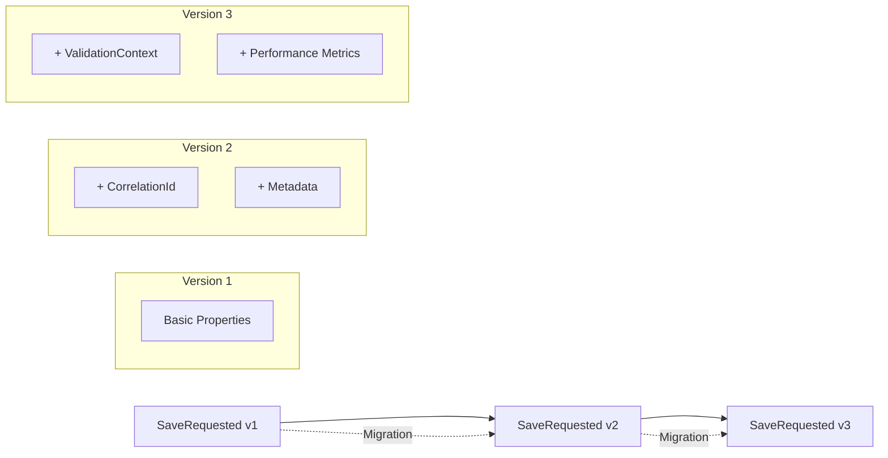

### Version Migration Example

```csharp
public class SaveRequestedV1ToV2Migrator : IMessageMigrator<SaveRequestedV1, SaveRequested<Item>>
{
    public SaveRequested<Item> Migrate(SaveRequestedV1 source)
    {
        return new SaveRequested<Item>(
            entityId: source.Id,
            entity: source.Data,
            auditId: source.AuditId,
            requestedAt: source.Timestamp,
            requestedBy: source.User,
            correlationId: Guid.NewGuid().ToString(),  // New in V2
            metadata: new Dictionary<string, object>   // New in V2
            {
                ["MigratedFrom"] = "V1",
                ["MigrationTimestamp"] = DateTime.UtcNow
            }
        );
    }
}
```

## Performance Optimization

### Message Batching Support

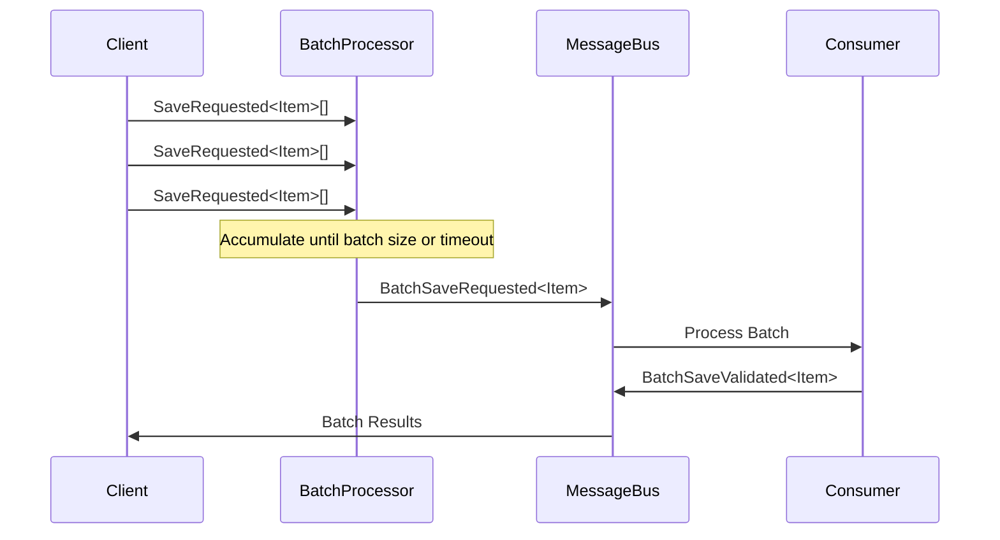

### Batch Message Structure

```csharp
public record BatchSaveRequested<T>(
    IEnumerable<SaveRequested<T>> Items,
    Guid BatchId,
    DateTime BatchCreatedAt,
    string BatchCreatedBy,
    BatchOptions Options
) where T : class;

public record BatchOptions(
    int MaxBatchSize = 100,
    TimeSpan MaxWaitTime = default,
    bool PreserveOrder = true,
    bool FailFast = false
);
```

### Message Compression

```csharp
// Configure message compression for large payloads
services.Configure<MessageBusOptions>(options =>
{
    options.EnableCompression = true;
    options.CompressionThreshold = 1024; // Compress messages > 1KB
    options.CompressionAlgorithm = CompressionAlgorithm.Gzip;
});
```

## Error Handling Messages

### SaveCommitFault<T>
Indicates a failure during save commit operation.

**Properties:**
- `EntityId` - Unique identifier for the entity
- `ErrorMessage` - Description of the error
- `ErrorCode` - Categorized error code
- `StackTrace` - Technical error details
- `AuditId` - Audit trail identifier
- `RetryAttempt` - Current retry attempt number

### ValidationOperationFailed
General failure message for any validation operation.

**Properties:**
- `EntityId` - Unique identifier for the entity
- `EntityType` - Type name of the entity
- `OperationType` - Type of operation that failed (Save, Delete, etc.)
- `ErrorMessage` - Description of the error
- `ErrorDetails` - Additional error context
- `FailedAt` - Timestamp of failure

## Message Correlation

### Correlation Patterns

All messages support correlation for tracking workflows:

```csharp
// Each message includes correlation information
public record SaveRequested<T>(
    Guid EntityId,                    // Primary correlation ID
    T Entity,
    Guid? AuditId = null,            // Audit correlation
    string? CorrelationId = null,    // Custom correlation
    string? CausationId = null       // Causation tracking
);
```

### Workflow Tracking

Track complete workflows using correlation:

```csharp
var correlationId = Guid.NewGuid().ToString();

// Start workflow
await bus.Publish(new SaveRequested<Item>(itemId, item, correlationId: correlationId));

// All subsequent messages include the same correlation ID
// SaveValidated, SaveCommitRequested, SaveCommitCompleted
```

## Serialization

### JSON Serialization

All messages are designed for JSON serialization:

```csharp
var options = new JsonSerializerOptions
{
    PropertyNamingPolicy = JsonNamingPolicy.CamelCase,
    WriteIndented = true,
    DefaultIgnoreCondition = JsonIgnoreCondition.WhenWritingNull
};

var json = JsonSerializer.Serialize(message, options);
```

### Binary Serialization

Support for high-performance binary serialization:

```csharp
// MessagePack support for high-throughput scenarios
[MessagePackObject]
public record SaveRequested<T>(...) where T : class;
```

## Usage Examples

### Publishing Save Request

```csharp
public class ItemService
{
    private readonly IBus _bus;
    
    public async Task<SaveResult> SaveItemAsync(Item item)
    {
        var auditId = Guid.NewGuid();
        
        var message = new SaveRequested<Item>(
            entityId: item.Id,
            entity: item,
            auditId: auditId,
            requestedAt: DateTime.UtcNow,
            requestedBy: _currentUser.Email
        );
        
        await _bus.Publish(message);
        
        return new SaveResult { AuditId = auditId, Status = SaveStatus.Requested };
    }
}
```

### Consuming Validation Messages

```csharp
public class SaveValidationConsumer : IConsumer<SaveRequested<Item>>
{
    private readonly IValidator<Item> _validator;
    
    public async Task Consume(ConsumeContext<SaveRequested<Item>> context)
    {
        var message = context.Message;
        var validationResult = await _validator.ValidateAsync(message.Entity);
        
        if (validationResult.IsValid)
        {
            await context.Publish(new SaveValidated<Item>(
                entityId: message.EntityId,
                entity: message.Entity,
                validationResult: validationResult,
                auditId: message.AuditId,
                validatedAt: DateTime.UtcNow
            ));
        }
        else
        {
            await context.Publish(new ValidationOperationFailed(
                entityId: message.EntityId,
                entityType: typeof(Item).Name,
                operationType: "Save",
                errorMessage: string.Join("; ", validationResult.Errors)
            ));
        }
    }
}
```

### Request-Response Pattern

```csharp
public class ValidationRequestClient
{
    private readonly IRequestClient<SaveRequested<Item>> _client;
    
    public async Task<SaveResponse> ValidateAndSaveAsync(Item item)
    {
        var request = new SaveRequested<Item>(
            entityId: item.Id,
            entity: item,
            auditId: Guid.NewGuid()
        );
        
        var response = await _client.GetResponse<SaveValidated<Item>, ValidationOperationFailed>(request);
        
        return response.Message switch
        {
            SaveValidated<Item> validated => new SaveResponse { Success = true, Data = validated },
            ValidationOperationFailed failed => new SaveResponse { Success = false, Error = failed.ErrorMessage },
            _ => throw new InvalidOperationException("Unexpected response type")
        };
    }
}
```

## Message Versioning

### Version Strategy

Messages support versioning for backward compatibility:

```csharp
public record SaveRequested<T> : IVersionedMessage
{
    public int Version { get; init; } = 2;  // Current version
    
    // Version 2 properties
    public string? CorrelationId { get; init; }
    public Dictionary<string, object>? Metadata { get; init; }
}
```

### Migration Support

Handle message version migrations:

```csharp
public class SaveRequestedV1ToV2Migrator : IMessageMigrator<SaveRequestedV1, SaveRequested<Item>>
{
    public SaveRequested<Item> Migrate(SaveRequestedV1 source)
    {
        return new SaveRequested<Item>(
            entityId: source.Id,
            entity: source.Data,
            auditId: source.AuditId,
            correlationId: Guid.NewGuid().ToString(),  // New in V2
            metadata: new()  // New in V2
        );
    }
}
```

## Testing Message Contracts

### Message Testing Strategy

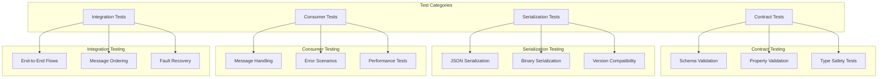

### Contract Testing Examples

```csharp
[Test]
public void SaveRequested_HasRequiredProperties()
{
    var message = new SaveRequested<Item>(
        entityId: Guid.NewGuid(),
        entity: new Item(100),
        auditId: Guid.NewGuid()
    );
    
    Assert.IsNotNull(message.EntityId);
    Assert.IsNotNull(message.Entity);
    Assert.IsNotNull(message.AuditId);
    Assert.IsTrue(message.Timestamp > DateTime.MinValue);
}

[Test]
public void SaveRequested_SerializesCorrectly()
{
    var item = new Item(100);
    var message = new SaveRequested<Item>(
        entityId: Guid.NewGuid(),
        entity: item,
        auditId: Guid.NewGuid()
    );
    
    var json = JsonSerializer.Serialize(message);
    var deserialized = JsonSerializer.Deserialize<SaveRequested<Item>>(json);
    
    Assert.AreEqual(message.EntityId, deserialized.EntityId);
    Assert.AreEqual(message.Entity.Metric, deserialized.Entity.Metric);
}
```

### Consumer Testing with Test Harness

```csharp
[Test]
public async Task SaveValidationConsumer_ValidEntity_PublishesSaveValidated()
{
    var harness = new InMemoryTestHarness();
    var consumer = harness.Consumer<SaveValidationConsumer>();
    
    await harness.Start();
    
    try
    {
        var item = new Item(100);
        await harness.InputQueueSendEndpoint.Send(new SaveRequested<Item>(
            entityId: item.Id,
            entity: item,
            auditId: Guid.NewGuid()
        ));
        
        // Verify message was consumed
        Assert.IsTrue(await harness.Consumed.Any<SaveRequested<Item>>());
        
        // Verify correct response was published
        Assert.IsTrue(await harness.Published.Any<SaveValidated<Item>>());
        
        // Verify no error messages
        Assert.IsFalse(await harness.Published.Any<ValidationOperationFailed>());
    }
    finally
    {
        await harness.Stop();
    }
}

[Test]
public async Task SaveValidationConsumer_InvalidEntity_PublishesValidationFailed()
{
    var harness = new InMemoryTestHarness();
    var consumer = harness.Consumer<SaveValidationConsumer>();
    
    await harness.Start();
    
    try
    {
        var invalidItem = new Item(-1); // Invalid metric
        await harness.InputQueueSendEndpoint.Send(new SaveRequested<Item>(
            entityId: invalidItem.Id,
            entity: invalidItem
        ));
        
        Assert.IsTrue(await harness.Consumed.Any<SaveRequested<Item>>());
        Assert.IsTrue(await harness.Published.Any<ValidationOperationFailed>());
        Assert.IsFalse(await harness.Published.Any<SaveValidated<Item>>());
    }
    finally
    {
        await harness.Stop();
    }
}
```

## Integration Examples

### Request-Response Pattern

```csharp
public class ValidationRequestClient
{
    private readonly IRequestClient<SaveRequested<Item>> _client;
    
    public ValidationRequestClient(IRequestClient<SaveRequested<Item>> client)
    {
        _client = client;
    }
    
    public async Task<SaveResponse> ValidateAndSaveAsync(Item item)
    {
        var request = new SaveRequested<Item>(
            entityId: item.Id,
            entity: item,
            auditId: Guid.NewGuid(),
            correlationId: Guid.NewGuid().ToString()
        );
        
        var response = await _client.GetResponse<SaveValidated<Item>, ValidationOperationFailed>(
            request, 
            timeout: TimeSpan.FromMinutes(1)
        );
        
        return response.Message switch
        {
            SaveValidated<Item> validated => new SaveResponse 
            { 
                Success = true, 
                Data = validated,
                ValidationResult = validated.ValidationResult
            },
            ValidationOperationFailed failed => new SaveResponse 
            { 
                Success = false, 
                Error = failed.ErrorMessage,
                ErrorSeverity = failed.Severity
            },
            _ => throw new InvalidOperationException("Unexpected response type")
        };
    }
}
```

### Saga Pattern Implementation

```csharp
public class SaveValidationSaga : MassTransitStateMachine<SaveValidationState>
{
    public SaveValidationSaga()
    {
        InstanceState(x => x.CurrentState);
        
        Event(() => SaveRequested, x => x.CorrelateById(context => context.Message.EntityId));
        Event(() => SaveValidated, x => x.CorrelateById(context => context.Message.EntityId));
        Event(() => SaveCommitCompleted, x => x.CorrelateById(context => context.Message.EntityId));
        Event(() => ValidationFailed, x => x.CorrelateById(context => context.Message.EntityId));
        
        Initially(
            When(SaveRequested)
                .Then(context => 
                {
                    context.Instance.EntityId = context.Data.EntityId;
                    context.Instance.StartedAt = DateTime.UtcNow;
                })
                .TransitionTo(Validating)
        );
        
        During(Validating,
            When(SaveValidated)
                .TransitionTo(Committing)
                .Publish(context => new SaveCommitRequested<Item>(
                    context.Data.EntityId,
                    context.Data.Entity,
                    context.Data.ValidationResult
                )),
                
            When(ValidationFailed)
                .TransitionTo(Failed)
                .Then(context => context.Instance.ErrorMessage = context.Data.ErrorMessage)
        );
        
        During(Committing,
            When(SaveCommitCompleted)
                .TransitionTo(Completed)
                .Then(context => context.Instance.CompletedAt = DateTime.UtcNow)
        );
    }
    
    public State Validating { get; private set; }
    public State Committing { get; private set; }
    public State Completed { get; private set; }
    public State Failed { get; private set; }
    
    public Event<SaveRequested<Item>> SaveRequested { get; private set; }
    public Event<SaveValidated<Item>> SaveValidated { get; private set; }
    public Event<SaveCommitCompleted<Item>> SaveCommitCompleted { get; private set; }
    public Event<ValidationOperationFailed> ValidationFailed { get; private set; }
}

public class SaveValidationState : SagaStateMachineInstance
{
    public Guid CorrelationId { get; set; }
    public string CurrentState { get; set; }
    public Guid EntityId { get; set; }
    public DateTime StartedAt { get; set; }
    public DateTime? CompletedAt { get; set; }
    public string? ErrorMessage { get; set; }
}
```

## Best Practices and Patterns

### Message Design Principles

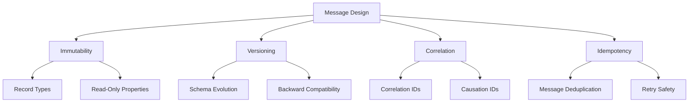

### 1. Immutability and Record Types

```csharp
// Good: Immutable record type
public record SaveRequested<T>(
    Guid EntityId,
    T Entity,
    Guid? AuditId = null
) where T : class;

// Avoid: Mutable class
public class SaveRequestedMutable<T>
{
    public Guid EntityId { get; set; }  // Mutable - avoid
    public T Entity { get; set; }       // Mutable - avoid
}
```

### 2. Message Versioning Strategy

```csharp
public interface IVersionedMessage
{
    int Version { get; }
    DateTime CreatedAt { get; }
}

public record SaveRequested<T> : IVersionedMessage where T : class
{
    public int Version { get; init; } = 2;  // Current version
    public DateTime CreatedAt { get; init; } = DateTime.UtcNow;
    
    // Version 2 properties
    public Guid EntityId { get; init; }
    public T Entity { get; init; }
    public string? CorrelationId { get; init; }  // Added in V2
    public Dictionary<string, object>? Metadata { get; init; }  // Added in V2
    
    // Backward compatibility constructor for V1
    public SaveRequested(Guid entityId, T entity)
    {
        EntityId = entityId;
        Entity = entity;
        Version = 1;
    }
}
```

### 3. Correlation and Causation

```csharp
public abstract record MessageBase
{
    public string CorrelationId { get; init; } = Guid.NewGuid().ToString();
    public string? CausationId { get; init; }
    public DateTime Timestamp { get; init; } = DateTime.UtcNow;
    
    protected MessageBase() { }
    
    protected MessageBase(string? causationId)
    {
        CausationId = causationId;
    }
}

public record SaveRequested<T> : MessageBase where T : class
{
    public SaveRequested(T entity, string? causationId = null) : base(causationId)
    {
        Entity = entity;
        EntityId = Guid.NewGuid();
    }
    
    public Guid EntityId { get; init; }
    public T Entity { get; init; }
}
```

### 4. Error Handling Patterns

```csharp
public record Result<T>
{
    public bool IsSuccess { get; init; }
    public T? Value { get; init; }
    public string? Error { get; init; }
    public ErrorSeverity Severity { get; init; }
    
    public static Result<T> Success(T value) => new() { IsSuccess = true, Value = value };
    public static Result<T> Failure(string error, ErrorSeverity severity = ErrorSeverity.Error) 
        => new() { IsSuccess = false, Error = error, Severity = severity };
}

// Usage in message handling
public async Task<Result<SaveValidated<Item>>> HandleSaveRequest(SaveRequested<Item> request)
{
    try
    {
        var validationResult = await _validator.ValidateAsync(request.Entity);
        
        if (validationResult.IsValid)
        {
            var response = new SaveValidated<Item>(
                request.EntityId,
                request.Entity,
                validationResult
            );
            return Result<SaveValidated<Item>>.Success(response);
        }
        
        return Result<SaveValidated<Item>>.Failure(
            $"Validation failed: {string.Join(", ", validationResult.Errors)}",
            ErrorSeverity.Warning
        );
    }
    catch (Exception ex)
    {
        return Result<SaveValidated<Item>>.Failure(
            $"System error: {ex.Message}",
            ErrorSeverity.Error
        );
    }
}
```

## Dependencies and Configuration

### Minimal Dependencies

The ValidationFlow.Messages assembly maintains minimal dependencies for clean contracts:

```xml
<PackageReference Include="System.Text.Json" Version="8.0.0" />
<PackageReference Include="MassTransit.Abstractions" Version="8.0.0" />
```

### Configuration Examples

```csharp
// Message serialization configuration
services.Configure<JsonOptions>(options =>
{
    options.SerializerOptions.PropertyNamingPolicy = JsonNamingPolicy.CamelCase;
    options.SerializerOptions.DefaultIgnoreCondition = JsonIgnoreCondition.WhenWritingNull;
    options.SerializerOptions.Converters.Add(new JsonStringEnumConverter());
});

// Message bus configuration
services.AddMassTransit(x =>
{
    x.SetKebabCaseEndpointNameFormatter();
    
    x.UsingRabbitMq((context, cfg) =>
    {
        cfg.Host("localhost", "/", h =>
        {
            h.Username("guest");
            h.Password("guest");
        });
        
        cfg.ConfigureJsonSerializerOptions(options =>
        {
            options.IncludeFields = true;
            return options;
        });
        
        cfg.ConfigureEndpoints(context);
    });
});
```

This comprehensive message system provides a robust foundation for distributed validation workflows while maintaining clean contracts, excellent performance characteristics, and extensive testing capabilities.